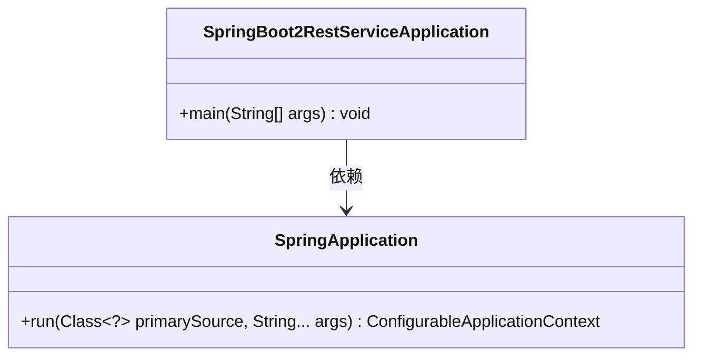
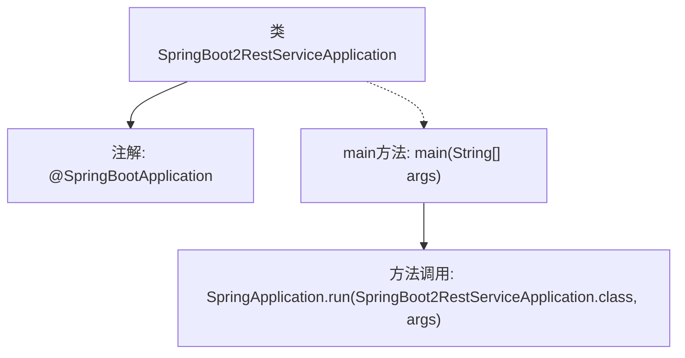

# 基础信息

|      |      |
|------|------|
| 名称 | SpringBoot2RestServiceApplication |
| 编码语言 | .java |
| 代码路径 | spring-boot-examples/spring-boot-2-rest-service-versioning/src/main/java/com/in28minutes/springboot/rest/example/SpringBoot2RestServiceApplication.java |
| 包名 | com.in28minutes.springboot.rest.example |
| 依赖项 | ['org.springframework.boot.SpringApplication', 'org.springframework.boot.autoconfigure.SpringBootApplication'] |
| 概述说明 | Spring Boot应用启动类，通过SpringApplication运行。 |

# 说明

Spring Boot应用的启动类通过SpringApplication类来运行，这是Spring Boot框架的核心启动机制。启动类通常包含主方法，用于初始化Spring上下文并启动应用程序。SpringApplication类负责自动配置、加载应用属性以及启动内嵌的Web服务器，简化了Spring应用的部署和运行流程。

# 类列表 Class Summary

| 名称   | 类型  | 说明 |
|-------|------|-------------|
| SpringBoot2RestServiceApplication | class | Spring Boot应用启动类，使用SpringApplication运行。 |

## 类 SpringBoot2RestServiceApplication

|      |      |
|------|------|
| 访问范围 | @SpringBootApplication;public |
| 类型 | class |
| 名称 | SpringBoot2RestServiceApplication |
| 说明 | Spring Boot应用启动类，使用SpringApplication运行。 |

### UML类图

### 描述
该代码定义了一个Spring Boot应用程序的入口类 `SpringBoot2RestServiceApplication`，其中包含一个 `main` 方法。`main` 方法通过调用 `SpringApplication.run` 方法来启动Spring Boot应用程序。`SpringApplication` 类提供了运行Spring应用的核心功能。`SpringBoot2RestServiceApplication` 类依赖于 `SpringApplication` 类来启动应用。

### 内部方法调用关系图

这段代码是一个Spring Boot应用程序的入口类，使用了`@SpringBootApplication`注解来标识这是一个Spring Boot应用。`main`方法是程序的启动点，通过调用`SpringApplication.run`方法来启动Spring Boot应用，并传入当前类`SpringBoot2RestServiceApplication.class`和命令行参数`args`。这段代码的主要作用是初始化并启动Spring Boot应用。

### 字段列表 Field List

| 名称  | 类型  | 说明 |
|-------|-------|------|

### 方法列表 Method List

| 名称  | 类型  | 说明 |
|-------|-------|------|
| main | void | Spring Boot应用启动类，运行主程序。 |

