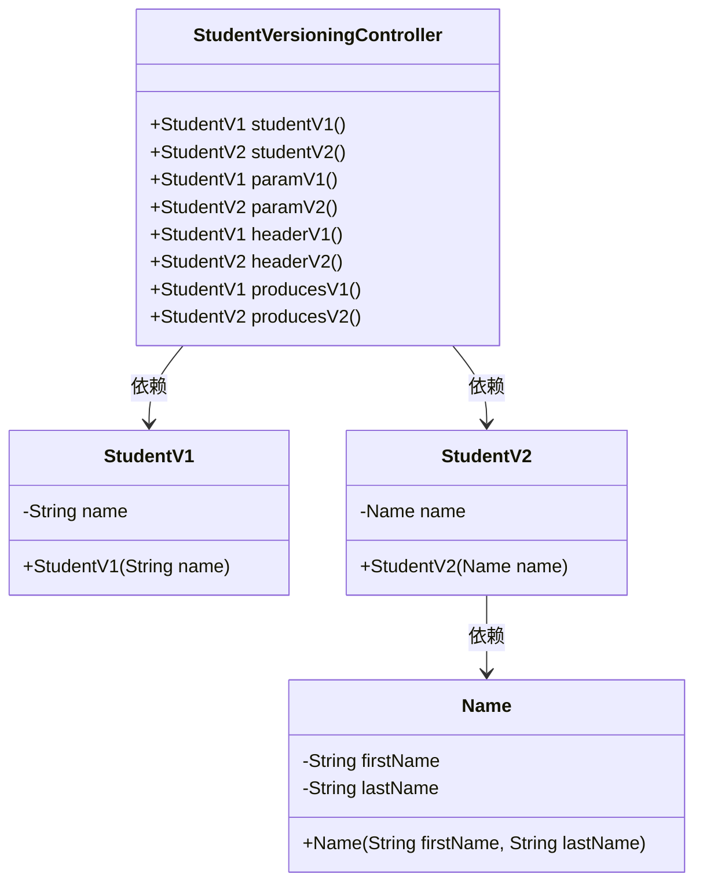
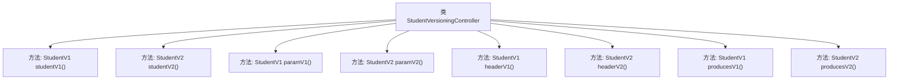

# 基础信息

|      |      |
|------|------|
| 名称 | StudentVersioningController |
| 编码语言 | .java |
| 代码路径 | spring-boot-examples/spring-boot-2-rest-service-versioning/src/main/java/com/in28minutes/springboot/rest/example/versioning/StudentVersioningController.java |
| 包名 | com.in28minutes.springboot.rest.example.versioning |
| 依赖项 | ['org.springframework.web.bind.annotation.GetMapping', 'org.springframework.web.bind.annotation.RestController'] |
| 概述说明 | 控制器实现多版本学生信息API，支持路径、参数、头和内容类型区分。 |

# 说明

控制器实现了多个版本的学生信息API，通过路径、参数、请求头和内容类型进行区分。该设计允许在同一控制器中处理不同版本的API请求，确保系统能够灵活应对不同客户端的需求。通过这种方式，开发者可以高效管理和维护多个API版本，同时保持代码的清晰性和可维护性。

# 类列表 Class Summary

| 名称   | 类型  | 说明 |
|-------|------|-------------|
| StudentVersioningController | class | 控制器实现不同版本的学生信息API，支持路径、参数、头和内容类型区分。 |

## 类 StudentVersioningController

|      |      |
|------|------|
| 访问范围 | @RestController;public |
| 类型 | class |
| 名称 | StudentVersioningController |
| 说明 | 控制器实现不同版本的学生信息API，支持路径、参数、头和内容类型区分。 |

### UML类图

这段代码定义了一个名为 `StudentVersioningController` 的控制器类，用于处理不同版本的 API 请求。该类通过多种方式（如 URL 路径、查询参数、请求头和媒体类型）来区分请求版本，并返回相应版本的 `StudentV1` 或 `StudentV2` 对象。`StudentV1` 和 `StudentV2` 分别表示不同版本的学生信息，其中 `StudentV2` 使用 `Name` 类来存储学生的姓和名。

### 内部方法调用关系图

这段代码定义了一个`StudentVersioningController`类，该类包含多个`@GetMapping`注解的方法，用于处理不同版本的`Student`对象请求。每个方法根据不同的URL路径、请求参数、请求头或媒体类型返回不同版本的`Student`对象（`StudentV1`或`StudentV2`）。代码展示了如何通过不同的请求方式来区分和返回不同版本的数据，实现了API版本控制的功能。

### 字段列表 Field List

| 名称  | 类型  | 说明 |
|-------|-------|------|

### 方法列表 Method List

| 名称  | 类型  | 说明 |
|-------|-------|------|
| studentV1 | StudentV1 | 通过GET请求获取学生V1信息，返回名为Bob Charlie的学生对象。 |
| producesV2 | StudentV2 | GET请求返回StudentV2对象，包含姓名Bob Charlie。 |
| paramV2 | StudentV2 | GET请求处理，返回StudentV2对象，包含Name属性。 |
| headerV2 | StudentV2 | 通过API版本2获取学生信息，返回包含姓名的StudentV2对象。 |
| studentV2 | StudentV2 | 获取学生信息的API，返回包含名字的StudentV2对象。 |
| paramV1 | StudentV1 | 通过GET请求获取版本1的学生信息，返回名为"Bob Charlie"的学生对象。 |
| producesV1 | StudentV1 | 通过GET请求获取学生信息，返回JSON格式的StudentV1对象。 |
| headerV1 | StudentV1 | 通过API版本1获取学生信息，返回学生V1对象。 |

