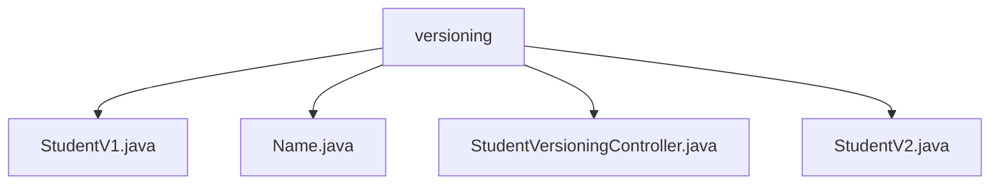

# 基础信息

|      |      |
|------|------|
| 名称 | versioning |
| 编码语言 | .java |
| 代码路径 | spring-boot-examples/spring-boot-2-rest-service-versioning/src/main/java/com/in28minutes/springboot/rest/example/versioning |
| 包名 | spring-boot-examples.spring-boot-2-rest-service-versioning.src.main.java.com.in28minutes.springboot.rest.example.versioning |
| 概述说明 | 控制器通过路径、参数、请求头和内容类型区分多个版本的学生信息API，确保灵活应对客户端需求。 |

# 说明

## 概述

该代码模块是一个基于Spring Boot的REST服务示例，主要展示了如何实现API版本控制。通过不同的版本控制策略（如路径、参数、请求头和内容类型），该模块允许在同一控制器中处理多个版本的API请求。这种设计使得系统能够灵活应对不同客户端的需求，同时保持代码的清晰性和可维护性。

## 主要业务场景

1. **API版本控制**：该模块的核心业务场景是实现API的版本控制。通过`StudentVersioningController`，开发者可以定义多个版本的API，并根据不同的版本控制策略（如路径、参数、请求头或内容类型）来区分和处理请求。

2. **学生信息管理**：该模块涉及对学生信息的管理，通过`StudentV1`和`StudentV2`等类来表示不同版本的学生信息。这些类可能包含不同的字段或结构，以适应不同版本的API需求。

3. **灵活性与可维护性**：通过在同一控制器中处理多个版本的API请求，该模块确保了系统的灵活性和可维护性。开发者可以高效地管理和维护多个API版本，而无需为每个版本创建单独的控制器。

4. **版本控制策略**：该模块展示了多种版本控制策略的实现，包括：
   - **路径版本控制**：通过URL路径来区分不同版本的API。
   - **参数版本控制**：通过查询参数来区分不同版本的API。
   - **请求头版本控制**：通过请求头信息来区分不同版本的API。
   - **内容类型版本控制**：通过请求的内容类型（如`application/vnd.company.app-v1+json`）来区分不同版本的API。

这些策略使得开发者可以根据具体需求选择最合适的版本控制方式。

### 包内部结构视图

该流程图展示了`versioning`目录下的文件层级关系。`versioning`作为根节点，直接包含了四个文件：`StudentV1.java`、`Name.java`、`StudentVersioningController.java`和`StudentV2.java`。这些文件都属于同一个目录，没有进一步的子目录结构，因此所有文件都直接与`versioning`节点相连。

# 文件列表 File List

| 名称   | 类型  | 说明 |
|-------|------|-------------|
| [StudentVersioningController.java](StudentVersioningController.md) | file | 控制器实现多版本学生信息API，支持路径、参数、头和内容类型区分。 |
| [StudentV1.java](StudentV1.md) | file | 信息为空，无法生成概要描述。 |
| [StudentV2.java](StudentV2.md) | file | 无内容可总结。 |
| [Name.java](Name.md) | file | 内容为空，无法生成概要描述。 |

