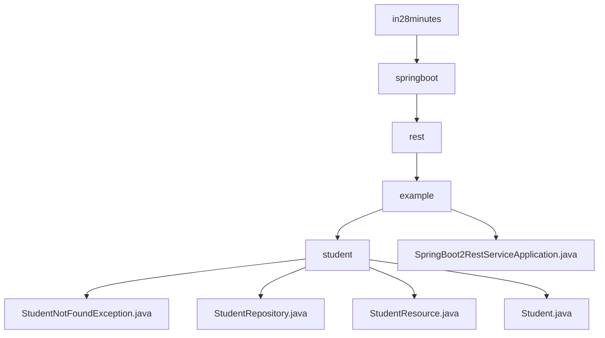

# 基础信息

|      |      |
|------|------|
| 名称 | in28minutes |
| 编码语言 | .java |
| 代码路径 | spring-boot-examples/spring-boot-2-rest-service-with-hateoas/src/main/java/com/in28minutes |
| 包名 | spring-boot-examples.spring-boot-2-rest-service-with-hateoas.src.main.java.com.in28minutes |
| 概述说明 | Spring Boot 2 RESTful服务示例，管理学生信息，支持增删改查和异常处理。 |

# 说明

## 概述
该代码模块是一个基于Spring Boot 2的RESTful服务示例，专注于学生信息的管理。模块通过使用HATEOAS（Hypermedia as the Engine of Application State）实现了REST服务的超媒体驱动设计。主要功能包括学生信息的增删改查操作，以及对学生查找失败情况的异常处理。模块中的各个类分工明确，分别负责数据存储、业务逻辑处理、异常处理和实体定义。Spring Boot应用启动类是Spring应用程序的入口点，负责加载Spring上下文并启动内嵌的Web服务器，使得应用程序能够处理HTTP请求。

## 主要业务场景
1. **学生信息管理**：通过`StudentResource`类提供了一系列API，支持对学生信息的全面管理。具体功能包括：
   - 获取所有学生信息
   - 根据学生ID查询特定学生信息
   - 删除学生记录
   - 创建新学生信息
   - 更新现有学生信息

2. **异常处理**：当程序在查找学生信息时未找到相关记录，`StudentNotFoundException`类会被抛出。该类继承自`RuntimeException`，属于运行时异常，因此不需要在方法签名中显式声明或捕获。这种设计使得异常处理更加灵活，适用于各种需要处理学生查找失败的场景。

3. **数据存储与访问**：`StudentRepository`类负责学生数据的存储与访问，为`StudentResource`类提供数据支持。

4. **实体定义**：`Student`类定义了学生实体的结构，包含`id`、`name`和`passportNumber`三个主要属性，并提供了相应的getter和setter方法，确保了数据的封装性和灵活性。

5. **应用启动**：`SpringBoot2RestServiceApplication`类是Spring Boot应用的启动类，负责加载Spring上下文并启动内嵌的Web服务器，使得应用程序能够处理HTTP请求。通过该启动类，Spring Boot会自动配置和初始化应用程序所需的各种组件和依赖，使得开发者能够快速构建和部署基于Spring的应用程序。

通过这些业务场景，该模块为管理学生数据提供了一个完整的解决方案，展示了如何在Spring Boot中构建一个RESTful服务并处理常见的业务逻辑和异常情况。

### 包内部结构视图

该流程图展示了从`in28minutes`到`student`目录的层级关系，以及`student`目录下的多个Java文件。`SpringBoot2RestServiceApplication.java`文件位于`example`目录下，而其他文件如`StudentNotFoundException.java`、`StudentRepository.java`、`StudentResource.java`和`Student.java`则位于`student`目录下。整体结构清晰，反映了项目的模块化设计。

# 文件列表 File List

| 名称   | 类型  | 说明 |
|-------|------|-------------|
| [springboot](springboot/_module.md) | package | Spring Boot 2 RESTful服务示例，管理学生信息，支持增删改查和异常处理。 |

