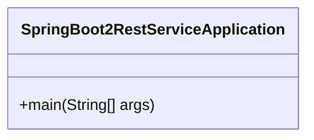
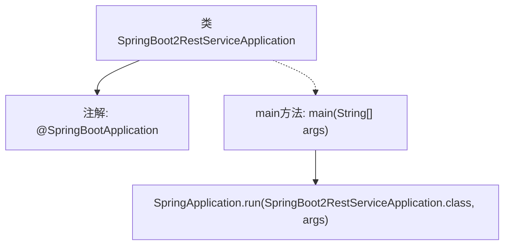

# 基础信息

|      |      |
|------|------|
| 名称 | SpringBoot2RestServiceApplication |
| 编码语言 | .java |
| 代码路径 | spring-boot-examples/spring-boot-2-rest-service-with-hateoas/src/main/java/com/in28minutes/springboot/rest/example/SpringBoot2RestServiceApplication.java |
| 包名 | com.in28minutes.springboot.rest.example |
| 依赖项 | ['org.springframework.boot.SpringApplication', 'org.springframework.boot.autoconfigure.SpringBootApplication'] |
| 概述说明 | Spring Boot 启动类，主方法运行应用。 |

# 说明

Spring Boot 应用启动类是 Spring 应用程序的入口点，其中包含主方法，用于启动和运行整个 Spring 应用。通过该启动类，Spring Boot 会自动配置和初始化应用程序所需的各种组件和依赖，使得开发者能够快速构建和部署基于 Spring 的应用程序。启动类的核心功能是加载 Spring 上下文，并启动内嵌的 Web 服务器，以便应用程序能够处理 HTTP 请求。此外，启动类还可以通过注解进行配置，例如指定扫描的包路径或启用特定的 Spring 功能模块。

# 类列表 Class Summary

| 名称   | 类型  | 说明 |
|-------|------|-------------|
| SpringBoot2RestServiceApplication | class | Spring Boot 应用启动类，主方法运行 Spring 应用。 |

## 类 SpringBoot2RestServiceApplication

|      |      |
|------|------|
| 访问范围 | @SpringBootApplication;public |
| 类型 | class |
| 名称 | SpringBoot2RestServiceApplication |
| 说明 | Spring Boot 应用启动类，主方法运行 Spring 应用。 |

### UML类图

这段代码定义了一个名为 `SpringBoot2RestServiceApplication` 的类，该类是 Spring Boot 应用的入口点。通过 `@SpringBootApplication` 注解，该类被标记为 Spring Boot 应用的主配置类。`main` 方法是应用的启动入口，调用 `SpringApplication.run` 方法来启动 Spring Boot 应用。这个类的主要作用是初始化并启动 Spring Boot 应用，使得应用能够运行并处理后续的请求。

### 内部方法调用关系图

这段代码定义了一个Spring Boot应用程序的入口类 `SpringBoot2RestServiceApplication`，使用了 `@SpringBootApplication` 注解来标记该类为Spring Boot应用的主配置类。`main` 方法是程序的启动入口，调用 `SpringApplication.run` 方法来启动Spring Boot应用，并传入当前类和命令行参数。

### 字段列表 Field List

| 名称  | 类型  | 说明 |
|-------|-------|------|

### 方法列表 Method List

| 名称  | 类型  | 说明 |
|-------|-------|------|
| main | void | Spring Boot 主类启动方法，运行应用程序。 |

