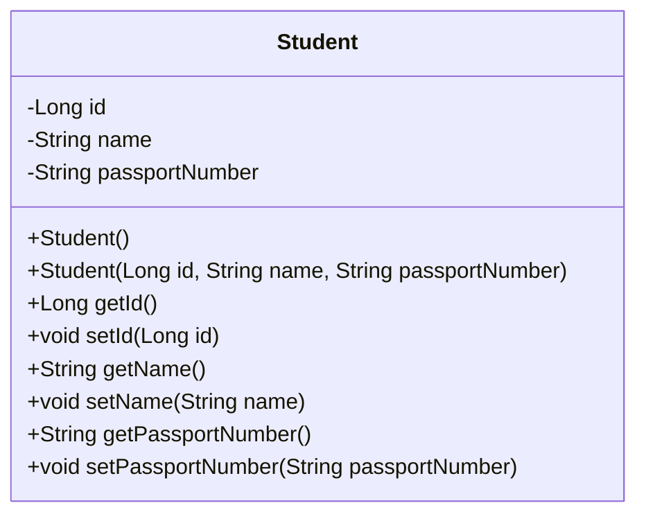
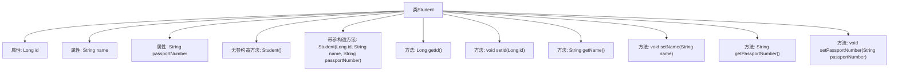

# 基础信息

|      |      |
|------|------|
| 名称 | Student |
| 编码语言 | .java |
| 代码路径 | spring-boot-examples/spring-boot-2-rest-service-with-hateoas/src/main/java/com/in28minutes/springboot/rest/example/student/Student.java |
| 包名 | com.in28minutes.springboot.rest.example.student |
| 依赖项 | ['jakarta.persistence.Entity', 'jakarta.persistence.GeneratedValue', 'jakarta.persistence.Id'] |
| 概述说明 | Student类包含id、name、passportNumber属性及其getter/setter方法。 |

# 说明

Student类是一个包含三个主要属性的实体类，分别是id、name和passportNumber。每个属性都配有对应的getter和setter方法，用于获取和设置这些属性的值。id属性通常用于唯一标识学生，name属性存储学生的姓名，passportNumber属性则记录学生的护照号码。通过getter方法，可以访问这些属性的值，而setter方法则允许对这些属性进行修改。这种设计确保了数据的封装性和灵活性。

# 类列表 Class Summary

| 名称   | 类型  | 说明 |
|-------|------|-------------|
| Student | class | Student类包含id、name、passportNumber属性及getter/setter方法。 |

## 类 Student

|      |      |
|------|------|
| 访问范围 | @Entity;public |
| 类型 | class |
| 名称 | Student |
| 说明 | Student类包含id、name、passportNumber属性及getter/setter方法。 |

### UML类图

这段代码定义了一个名为 `Student` 的实体类，该类包含三个私有属性：`id`、`name` 和 `passportNumber`。类中提供了两个构造函数，一个无参构造函数和一个带参构造函数，用于初始化对象。此外，类中还提供了各个属性的 getter 和 setter 方法，用于访问和修改这些属性的值。`Student` 类是一个典型的实体类，通常用于表示数据库中的表或对象关系映射（ORM）中的实体。

### 内部方法调用关系图

这段代码定义了一个名为 `Student` 的实体类，包含三个属性：`id`、`name` 和 `passportNumber`。类中提供了无参和带参的构造方法，以及每个属性的 `getter` 和 `setter` 方法。`id` 属性使用了 `@Id` 和 `@GeneratedValue` 注解，表示它是实体的主键，并且其值由数据库自动生成。这个类主要用于表示学生对象，并通过方法访问和修改其属性。

### 字段列表 Field List

| 名称  | 类型  | 说明 |
|-------|-------|------|
| id | Long | 实体类中定义了一个自动生成的长整型ID字段。 |
| name | String | 定义私有字符串变量name。 |
| passportNumber | String | 私有字符串类型变量，存储护照号码。 |

### 方法列表 Method List

| 名称  | 类型  | 说明 |
|-------|-------|------|
| getPassportNumber | String | 获取护照号码的方法。 |
| setId | void | 该方法用于设置对象的ID属性。 |
| setName | void | 该方法用于设置对象的名称属性。 |
| getId | Long | 该方法返回一个长整型变量id的值。 |
| getName | String | 该方法返回对象的名称属性值。 |
| setPassportNumber | void | 设置护照号码的方法。 |

