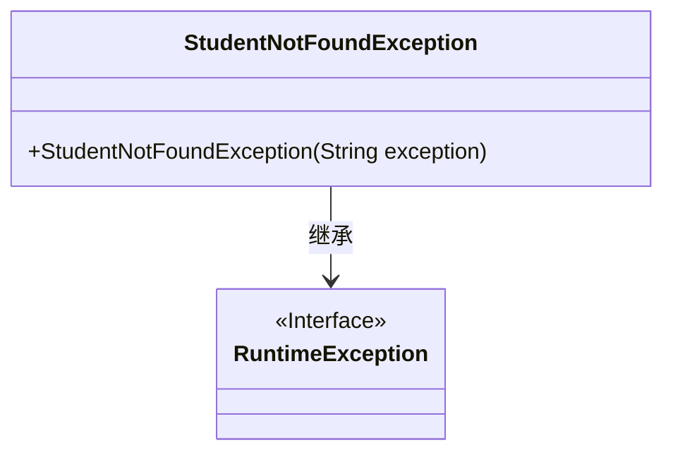
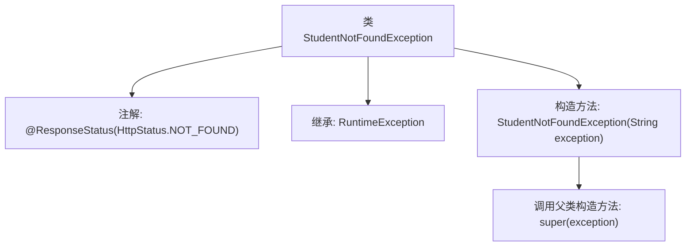

# 基础信息

|      |      |
|------|------|
| 名称 | StudentNotFoundException |
| 编码语言 | .java |
| 代码路径 | spring-boot-examples/spring-boot-2-rest-service-with-hateoas/src/main/java/com/in28minutes/springboot/rest/example/student/StudentNotFoundException.java |
| 包名 | com.in28minutes.springboot.rest.example.student |
| 依赖项 | ['org.springframework.http.HttpStatus', 'org.springframework.web.bind.annotation.ResponseStatus'] |
| 概述说明 | StudentNotFoundException继承RuntimeException，表示学生未找到异常。 |

# 说明

StudentNotFoundException类是一个用于表示学生未找到情况的异常类，它继承自RuntimeException。RuntimeException是Java中所有运行时异常的超类，因此StudentNotFoundException也属于运行时异常，不需要在方法签名中显式声明或捕获。该类的主要作用是在程序运行过程中，当尝试查找学生信息但未找到时，抛出该异常以通知调用者或上层逻辑处理这种情况。通过继承RuntimeException，StudentNotFoundException可以灵活地用于各种需要处理学生查找失败的场景。

# 类列表 Class Summary

| 名称   | 类型  | 说明 |
|-------|------|-------------|
| StudentNotFoundException | class | StudentNotFoundException类表示学生未找到异常，继承RuntimeException。 |

## 类 StudentNotFoundException

|      |      |
|------|------|
| 访问范围 | @ResponseStatus(HttpStatus.NOT_FOUND);public |
| 类型 | class |
| 名称 | StudentNotFoundException |
| 说明 | StudentNotFoundException类表示学生未找到异常，继承RuntimeException。 |

### UML类图

这段代码定义了一个名为 `StudentNotFoundException` 的异常类，它继承自 `RuntimeException`。该异常类用于在找不到学生时抛出，并通过构造函数接收一个字符串参数来设置异常信息。`@ResponseStatus(HttpStatus.NOT_FOUND)` 注解表明当此异常被抛出时，HTTP响应状态码应为404（未找到）。

### 内部方法调用关系图

这段代码定义了一个名为 `StudentNotFoundException` 的异常类，该类继承自 `RuntimeException`，并使用 `@ResponseStatus(HttpStatus.NOT_FOUND)` 注解标记，表示当抛出此异常时，HTTP 响应状态码应为 404（未找到）。类中包含一个构造方法，接受一个字符串参数 `exception`，并通过 `super(exception)` 调用父类的构造方法，将异常信息传递给父类。这个类通常用于在应用程序中处理学生信息未找到的情况。

### 字段列表 Field List

| 名称  | 类型  | 说明 |
|-------|-------|------|

### 方法列表 Method List

| 名称  | 类型  | 说明 |
|-------|-------|------|

