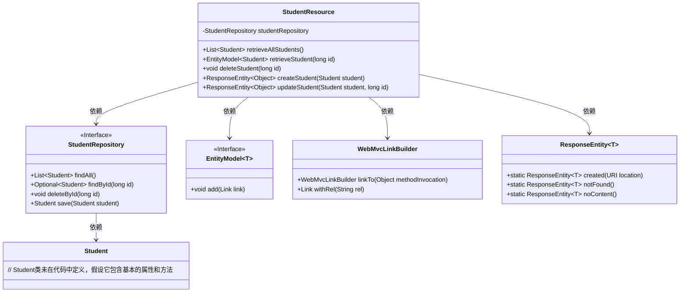

# 基础信息

|      |      |
|------|------|
| 名称 | StudentResource |
| 编码语言 | .java |
| 代码路径 | spring-boot-examples/spring-boot-2-rest-service-with-hateoas/src/main/java/com/in28minutes/springboot/rest/example/student/StudentResource.java |
| 包名 | com.in28minutes.springboot.rest.example.student |
| 依赖项 | ['org.springframework.hateoas.server.mvc.WebMvcLinkBuilder.linkTo', 'org.springframework.hateoas.server.mvc.WebMvcLinkBuilder.methodOn', 'java.net.URI', 'java.util.List', 'java.util.Optional', 'org.springframework.beans.factory.annotation.Autowired', 'org.springframework.hateoas.EntityModel', 'org.springframework.hateoas.server.mvc.WebMvcLinkBuilder', 'org.springframework.http.ResponseEntity', 'org.springframework.web.bind.annotation.DeleteMapping', 'org.springframework.web.bind.annotation.GetMapping', 'org.springframework.web.bind.annotation.PathVariable', 'org.springframework.web.bind.annotation.PostMapping', 'org.springframework.web.bind.annotation.PutMapping', 'org.springframework.web.bind.annotation.RequestBody', 'org.springframework.web.bind.annotation.RequestMapping', 'org.springframework.web.bind.annotation.RestController', 'org.springframework.web.servlet.support.ServletUriComponentsBuilder'] |
| 概述说明 | StudentResource类提供学生数据的增删改查API。 |

# 说明

StudentResource类提供了全面的学生数据管理API，支持对学生信息的增删改查操作。具体功能包括获取所有学生信息、根据学生ID查询特定学生信息、删除学生记录、创建新学生信息以及更新现有学生信息。这些API为管理学生数据提供了完整的解决方案。

# 类列表 Class Summary

| 名称   | 类型  | 说明 |
|-------|------|-------------|
| StudentResource | class | StudentResource类提供学生数据的增删改查API，包括获取所有学生、按ID查询、删除、创建和更新学生信息。 |

## 类 StudentResource

|      |      |
|------|------|
| 访问范围 | @RestController;@RequestMapping("/students");public |
| 类型 | class |
| 名称 | StudentResource |
| 说明 | StudentResource类提供学生数据的增删改查API，包括获取所有学生、按ID查询、删除、创建和更新学生信息。 |

### UML类图

这段代码定义了一个`StudentResource`类，它是一个REST控制器，用于处理与学生相关的HTTP请求。`StudentResource`依赖于`StudentRepository`接口来访问学生数据，并提供了检索、删除、创建和更新学生信息的方法。代码中还使用了`EntityModel`和`WebMvcLinkBuilder`来构建HATEOAS风格的响应，以及`ResponseEntity`来返回HTTP响应状态。

### 内部方法调用关系图

```mermaid
graph TD
    A["类StudentResource"]
    B["属性: StudentRepository studentRepository"]
    C["方法: List<Student> retrieveAllStudents()"]
    D["方法: EntityModel<Student> retrieveStudent(long id)"]
    E["方法: void deleteStudent(long id)"]
    F["方法: ResponseEntity<Object> createStudent(Student student)"]
    G["方法: ResponseEntity<Object> updateStudent(Student student, long id)"]
    H["调用: studentRepository.findAll()"]
    I["调用: studentRepository.findById(id)"]
    J["调用: studentRepository.deleteById(id)"]
    K["调用: studentRepository.save(student)"]
    L["调用: ServletUriComponentsBuilder.fromCurrentRequest().path('/{id}').buildAndExpand(savedStudent.getId()).toUri()"]
    M["调用: ResponseEntity.created(location).build()"]
    N["调用: ResponseEntity.notFound().build()"]
    O["调用: ResponseEntity.noContent().build()"]
    P["调用: EntityModel.of(student.get())"]
    Q["调用: linkTo(methodOn(this.getClass()).retrieveAllStudents())"]
    R["调用: resource.add(linkTo.withRel('all-students'))"]
    S["异常: throw new StudentNotFoundException('id-' + id)"]

    A --> B
    A --> C
    A --> D
    A --> E
    A --> F
    A --> G
    C --> H
    D --> I
    D --> S
    D --> P
    D --> Q
    D --> R
    E --> J
    F --> K
    F --> L
    F --> M
    G --> I
    G --> N
    G --> K
    G --> O
```

这段代码是一个Spring Boot的REST控制器，用于管理学生资源。它提供了获取所有学生、获取单个学生、删除学生、创建学生和更新学生的功能。代码通过`StudentRepository`与数据库交互，处理HTTP请求并返回相应的响应。流程图展示了各个方法之间的调用关系以及异常处理。

### 字段列表 Field List

| 名称  | 类型  | 说明 |
|-------|-------|------|
| studentRepository | StudentRepository | 自动注入学生仓库实例。 |

### 方法列表 Method List

| 名称  | 类型  | 说明 |
|-------|-------|------|
| createStudent | ResponseEntity<Object> | 创建学生并返回其位置信息。 |
| retrieveStudent | EntityModel<Student> | 通过ID获取学生信息，若不存在则抛出异常，并添加获取所有学生信息的链接。 |
| updateStudent | ResponseEntity<Object> | 通过ID更新学生信息，若不存在则返回404，否则保存并返回204。 |
| deleteStudent | void | 删除指定ID的学生记录。 |
| retrieveAllStudents | List<Student> | 该代码通过GET请求获取所有学生数据并返回列表。 |

