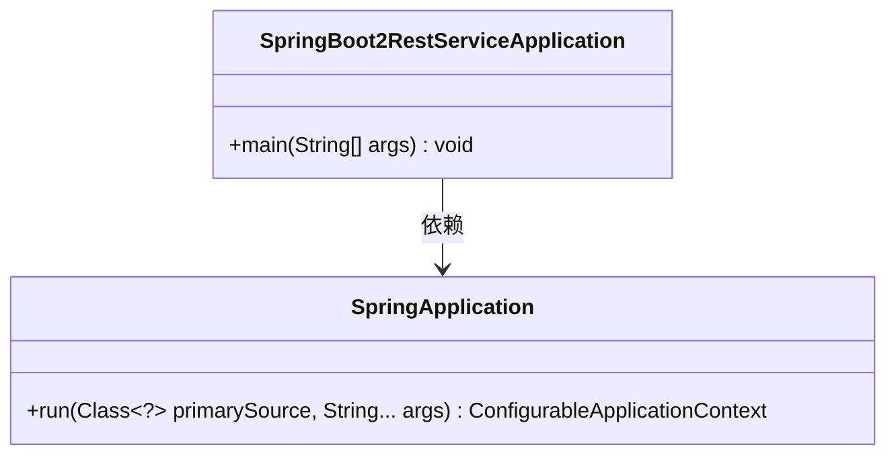
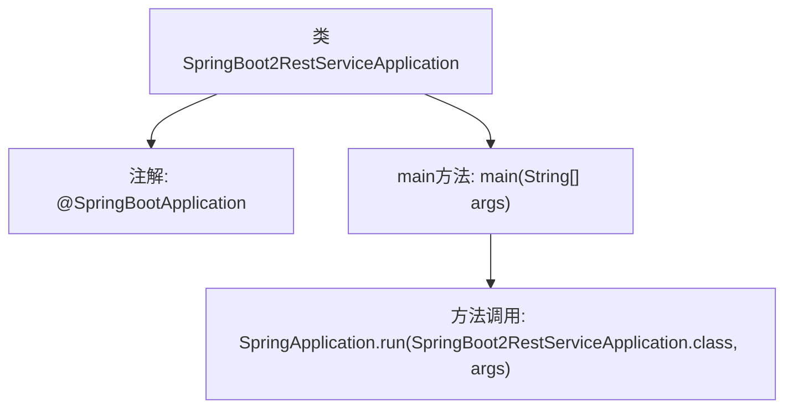

# 基础信息

|      |      |
|------|------|
| 名称 | SpringBoot2RestServiceApplication |
| 编码语言 | .java |
| 代码路径 | spring-boot-examples/spring-boot-2-rest-service-with-swagger/src/main/java/com/in28minutes/springboot/rest/example/SpringBoot2RestServiceApplication.java |
| 包名 | com.in28minutes.springboot.rest.example |
| 依赖项 | ['org.springframework.boot.SpringApplication', 'org.springframework.boot.autoconfigure.SpringBootApplication'] |
| 概述说明 | Spring Boot主类启动REST服务。 |

# 说明

Spring Boot应用的主类负责启动REST服务，是应用程序的入口点。该类通过Spring Boot的自动配置机制，简化了传统Spring应用的配置和部署过程。它通常包含主方法，用于初始化Spring上下文并启动嵌入式服务器，使应用能够快速运行并提供RESTful API服务。

# 类列表 Class Summary

| 名称   | 类型  | 说明 |
|-------|------|-------------|
| SpringBoot2RestServiceApplication | class | Spring Boot应用主类，启动REST服务。 |

## 类 SpringBoot2RestServiceApplication

|      |      |
|------|------|
| 访问范围 | @SpringBootApplication;public |
| 类型 | class |
| 名称 | SpringBoot2RestServiceApplication |
| 说明 | Spring Boot应用主类，启动REST服务。 |

### UML类图

**描述：**  
`SpringBoot2RestServiceApplication` 是一个 Spring Boot 应用程序的启动类，它通过 `main` 方法启动应用程序。该类依赖于 `SpringApplication` 类的 `run` 方法，该方法负责启动 Spring 应用上下文并返回一个 `ConfigurableApplicationContext` 实例。整个流程展示了 Spring Boot 应用程序的启动过程。

### 内部方法调用关系图

这段代码是一个Spring Boot应用程序的入口类。`@SpringBootApplication`注解标记了该类为Spring Boot应用的主配置类。`main`方法是程序的启动入口，它通过调用`SpringApplication.run`方法来启动Spring Boot应用，并传入当前类和命令行参数。流程图展示了类与注解、方法之间的关系，以及`main`方法如何启动Spring Boot应用。

### 字段列表 Field List

| 名称  | 类型  | 说明 |
|-------|-------|------|

### 方法列表 Method List

| 名称  | 类型  | 说明 |
|-------|-------|------|
| main | void | Spring Boot应用启动主方法，运行指定类。 |

