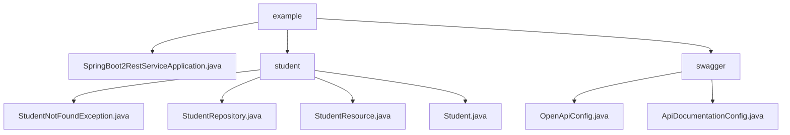

# 基础信息

|      |      |
|------|------|
| 名称 | example |
| 编码语言 | .java |
| 代码路径 | spring-boot-examples/spring-boot-2-rest-service-with-swagger/src/main/java/com/in28minutes/springboot/rest/example |
| 包名 | spring-boot-examples.spring-boot-2-rest-service-with-swagger.src.main.java.com.in28minutes.springboot.rest.example |
| 概述说明 | 基于Spring Boot 2的REST服务，管理学生信息，集成Swagger生成API文档。 |

# 说明

## 概述
该代码模块是一个基于Spring Boot 2的RESTful服务示例，主要用于管理学生信息。模块包含多个关键组件，包括自定义异常类、学生资源控制器、学生数据存储库以及学生实体类。通过这些组件，模块实现了对学生信息的增删改查操作，并通过Swagger提供了API文档支持。此外，模块还集成了Swagger用于生成和管理OpenAPI文档，确保API文档的生成和展示符合开发者的需求。

## 主要业务场景
1. **学生信息管理**：通过学生资源控制器（`StudentResource`），用户可以执行查询、删除、创建和更新学生信息的操作。这些操作通过REST API暴露，便于外部系统或前端应用调用。
2. **异常处理**：当系统尝试查找学生信息但未找到时，会抛出`StudentNotFoundException`异常。该自定义异常类用于精确捕捉和处理特定场景下的错误，提高代码的可读性和可维护性。
3. **数据存储与检索**：学生数据存储库（`StudentRepository`）负责与底层数据库交互，实现学生信息的持久化存储和检索。
4. **数据结构定义**：学生类（`Student`）定义了学生信息的数据结构，包含ID、姓名和护照号三个主要属性，确保学生信息的基本完整性和规范性。
5. **OpenAPI文档生成与配置**：通过`OpenApiConfig`类，开发者可以生成一个包含标题、描述、版本、许可证以及外部文档等信息的OpenAPI实例。该配置类允许开发者灵活定制API文档的详细内容，确保生成的文档符合项目需求。
6. **Swagger集成与API文档展示**：`ApiDocumentationConfig`类负责配置Swagger的集成，确保API文档能够通过Swagger UI展示。开发者可以通过该配置类调整Swagger的展示方式，如启用或禁用某些功能，或者自定义UI的外观。
7. **REST服务的API文档管理**：该模块主要用于管理和展示REST服务的API文档，帮助开发者和其他利益相关者更好地理解和使用API。通过Swagger生成的OpenAPI文档，开发者可以快速查看API的详细信息，包括请求参数、响应格式、错误码等。

该模块通过Spring Boot的自动配置机制，简化了传统Spring应用的配置和部署过程，使应用能够快速运行并提供RESTful API服务。

### 包内部结构视图

该流程图展示了Spring Boot示例项目中的文件结构。根节点为`example`，包含三个子节点：`SpringBoot2RestServiceApplication.java`、`student`和`swagger`。`student`节点下包含四个文件，分别是`StudentNotFoundException.java`、`StudentRepository.java`、`StudentResource.java`和`Student.java`。`swagger`节点下包含两个文件，分别是`OpenApiConfig.java`和`ApiDocumentationConfig.java`。

# 文件列表 File List

| 名称   | 类型  | 说明 |
|-------|------|-------------|
| [SpringBoot2RestServiceApplication.java](SpringBoot2RestServiceApplication.md) | file | Spring Boot主类启动REST服务。 |
| [swagger](swagger/_module.md) | package | OpenApiConfig类用于配置OpenAPI实例，包含标题、描述、版本等信息，定制API文档。 |
| [student](student/_module.md) | package | 自定义异常类处理学生未找到，学生资源控制器管理增删改查，学生类存储ID、姓名、护照号。 |

