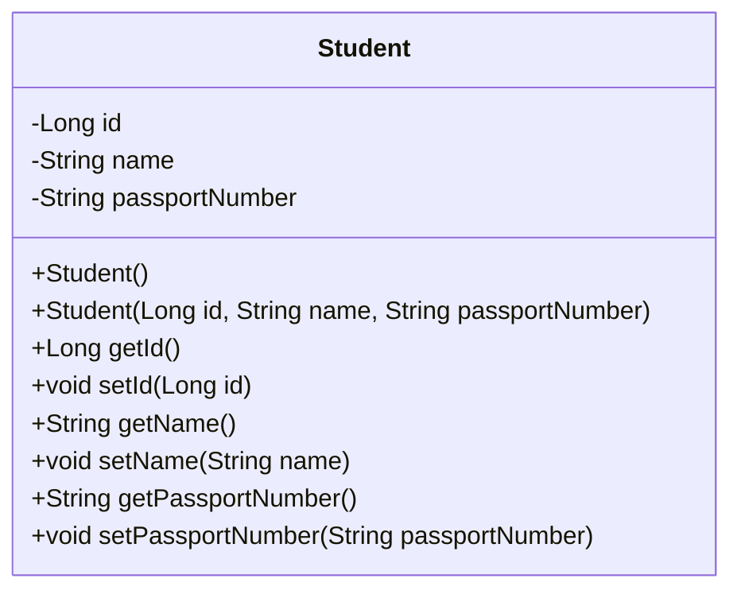
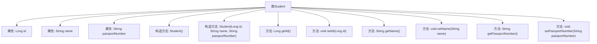

# 基础信息

|      |      |
|------|------|
| 名称 | Student |
| 编码语言 | .java |
| 代码路径 | spring-boot-examples/spring-boot-2-rest-service-with-swagger/src/main/java/com/in28minutes/springboot/rest/example/student/Student.java |
| 包名 | com.in28minutes.springboot.rest.example.student |
| 依赖项 | ['io.swagger.v3.oas.annotations.media.Schema', 'jakarta.persistence.Entity', 'jakarta.persistence.GeneratedValue', 'jakarta.persistence.Id', 'jakarta.validation.constraints.Size'] |
| 概述说明 | 学生类含ID、姓名、护照号，姓名需至少2字符。 |

# 说明

学生类是一个数据结构，用于存储学生的相关信息。该类包含三个主要属性：ID、姓名和护照号。其中，ID用于唯一标识每个学生；姓名是学生的全名，要求至少包含两个字符；护照号则用于记录学生的护照信息，便于身份验证和国际事务处理。该类的设计确保了学生信息的基本完整性和规范性。

# 类列表 Class Summary

| 名称   | 类型  | 说明 |
|-------|------|-------------|
| Student | class | 学生类包含ID、姓名和护照号，姓名至少2字符。 |

## 类 Student

|      |      |
|------|------|
| 访问范围 | @Entity;@Schema(description = "All details about the student. ");public |
| 类型 | class |
| 名称 | Student |
| 说明 | 学生类包含ID、姓名和护照号，姓名至少2字符。 |

### UML类图

**描述：**  
`Student` 类是一个实体类，用于表示学生的详细信息。它包含三个私有属性：`id`（学生的唯一标识符）、`name`（学生姓名，要求至少包含2个字符）和 `passportNumber`（护照号码）。类中提供了无参构造函数和带参构造函数，以及每个属性的 getter 和 setter 方法。该类通常用于数据库映射或数据传输对象（DTO）的场景。

### 内部方法调用关系图

这段代码定义了一个名为 `Student` 的实体类，包含三个属性：`id`、`name` 和 `passportNumber`。类中提供了两个构造方法，一个无参构造方法和一个带参构造方法，用于初始化对象。此外，类中还为每个属性提供了相应的 getter 和 setter 方法，用于访问和修改属性的值。代码使用了 `@Entity` 注解标识该类为实体类，并通过 `@Schema` 和 `@Size` 注解对属性进行了描述和约束。

### 字段列表 Field List

| 名称  | 类型  | 说明 |
|-------|-------|------|
| name | String | 名称至少需包含2个字符。 |
| passportNumber | String | 定义私有字符串变量护照号码。 |
| id | Long | 实体类中定义了一个自动生成的长整型ID字段。 |

### 方法列表 Method List

| 名称  | 类型  | 说明 |
|-------|-------|------|
| getPassportNumber | String | 获取护照号码的方法。 |
| getId | Long | 获取对象的唯一标识符ID。 |
| setName | void | 该方法用于设置对象的名称属性。 |
| setPassportNumber | void | 设置护照号码的方法。 |
| setId | void | 该方法用于设置对象的ID属性。 |
| getName | String | 该方法返回字符串类型的name属性值。 |

