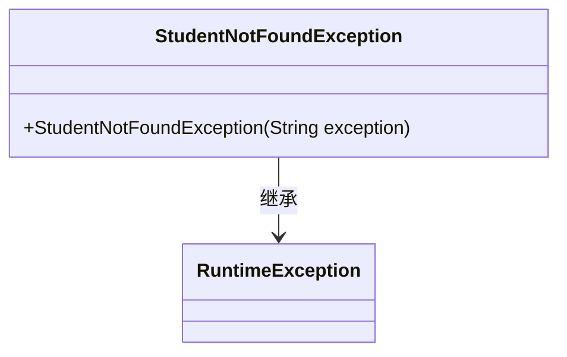
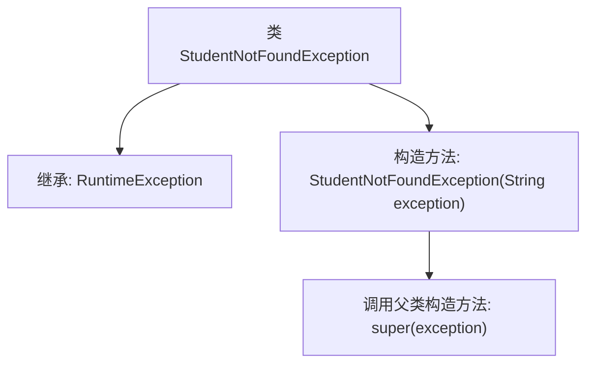

# 基础信息

|      |      |
|------|------|
| 名称 | StudentNotFoundException |
| 编码语言 | .java |
| 代码路径 | spring-boot-examples/spring-boot-2-rest-service-with-swagger/src/main/java/com/in28minutes/springboot/rest/example/student/StudentNotFoundException.java |
| 包名 | com.in28minutes.springboot.rest.example.student |
| 依赖项 | [] |
| 概述说明 | 自定义异常类用于处理学生未找到的情况。 |

# 说明

该内容描述了一个自定义异常类，专门用于处理学生未找到的情况。这个异常类旨在在程序运行过程中，当系统尝试查找学生信息但未能找到时，抛出该异常以提示用户或开发者相关错误。通过自定义异常类，可以更精确地捕捉和处理特定场景下的错误，提高代码的可读性和可维护性。

# 类列表 Class Summary

| 名称   | 类型  | 说明 |
|-------|------|-------------|
| StudentNotFoundException | class | 自定义异常类，用于处理学生未找到的情况。 |

## 类 StudentNotFoundException

|      |      |
|------|------|
| 访问范围 | public |
| 类型 | class |
| 名称 | StudentNotFoundException |
| 说明 | 自定义异常类，用于处理学生未找到的情况。 |

### UML类图

**描述**：`StudentNotFoundException` 是一个自定义的运行时异常类，继承自 `RuntimeException`。它通过构造函数接收一个字符串参数，并将其传递给父类的构造函数，用于在抛出异常时提供详细的错误信息。这种设计使得在应用程序中可以更精确地捕获和处理与学生相关的异常情况。

### 内部方法调用关系图

这段代码定义了一个名为 `StudentNotFoundException` 的异常类，它继承自 `RuntimeException`。该类的构造方法接受一个字符串参数 `exception`，并通过 `super(exception)` 调用父类的构造方法。这个类通常用于在应用程序中抛出学生未找到的异常，表示在查找学生时发生了错误。

### 字段列表 Field List

| 名称  | 类型  | 说明 |
|-------|-------|------|

### 方法列表 Method List

| 名称  | 类型  | 说明 |
|-------|-------|------|

