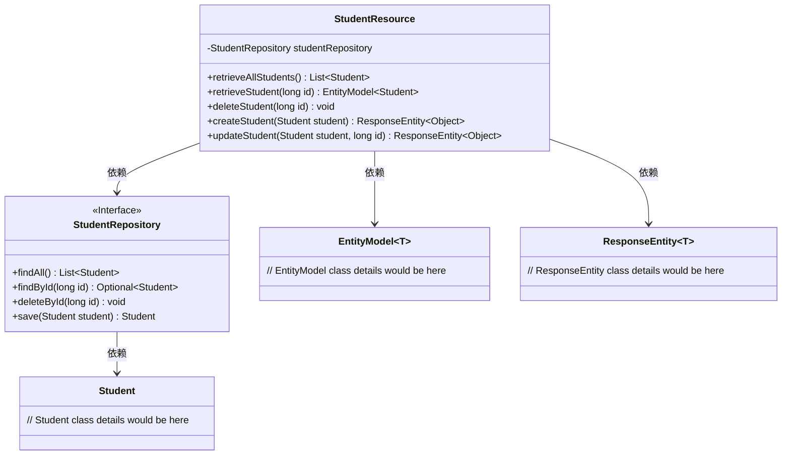

# 基础信息

|      |      |
|------|------|
| 名称 | StudentResource |
| 编码语言 | .java |
| 代码路径 | spring-boot-examples/spring-boot-2-rest-service-with-swagger/src/main/java/com/in28minutes/springboot/rest/example/student/StudentResource.java |
| 包名 | com.in28minutes.springboot.rest.example.student |
| 依赖项 | ['org.springframework.hateoas.server.mvc.WebMvcLinkBuilder.linkTo', 'org.springframework.hateoas.server.mvc.WebMvcLinkBuilder.methodOn', 'java.net.URI', 'java.util.List', 'java.util.Optional', 'io.swagger.v3.oas.annotations.Operation', 'org.springframework.beans.factory.annotation.Autowired', 'org.springframework.hateoas.EntityModel', 'org.springframework.hateoas.server.mvc.WebMvcLinkBuilder', 'org.springframework.http.ResponseEntity', 'org.springframework.web.bind.annotation.DeleteMapping', 'org.springframework.web.bind.annotation.GetMapping', 'org.springframework.web.bind.annotation.PathVariable', 'org.springframework.web.bind.annotation.PostMapping', 'org.springframework.web.bind.annotation.PutMapping', 'org.springframework.web.bind.annotation.RequestBody', 'org.springframework.web.bind.annotation.RestController', 'org.springframework.web.servlet.support.ServletUriComponentsBuilder'] |
| 概述说明 | 学生资源控制器提供增删改查学生信息的API。 |

# 说明

学生资源控制器是一个用于管理学生信息的API工具，主要功能包括查询、删除、创建和更新学生信息。该控制器提供了全面的操作接口，方便用户通过API调用来实现对学生数据的增删改查。通过这一工具，用户可以高效地管理和维护学生信息，确保数据的准确性和实时性。

# 类列表 Class Summary

| 名称   | 类型  | 说明 |
|-------|------|-------------|
| StudentResource | class | 学生资源控制器，提供查询、删除、创建和更新学生信息的API。 |

## 类 StudentResource

|      |      |
|------|------|
| 访问范围 | @RestController;public |
| 类型 | class |
| 名称 | StudentResource |
| 说明 | 学生资源控制器，提供查询、删除、创建和更新学生信息的API。 |

### UML类图

这段代码定义了一个`StudentResource`类，它是一个Spring Boot的REST控制器，负责处理与学生相关的HTTP请求。`StudentResource`类依赖于`StudentRepository`接口来访问学生数据，并返回`EntityModel`和`ResponseEntity`类型的响应。`StudentRepository`接口定义了与数据库交互的方法，如`findAll`、`findById`、`deleteById`和`save`。`StudentResource`类通过`StudentRepository`接口来执行CRUD操作，并返回相应的HTTP响应。

### 内部方法调用关系图

```mermaid
graph TD
    A["类StudentResource"]
    B["属性: StudentRepository studentRepository"]
    C["方法: List<Student> retrieveAllStudents()"]
    D["方法: EntityModel<Student> retrieveStudent(long id)"]
    E["方法: void deleteStudent(long id)"]
    F["方法: ResponseEntity<Object> createStudent(Student student)"]
    G["方法: ResponseEntity<Object> updateStudent(Student student, long id)"]
    H["调用: studentRepository.findAll()"]
    I["调用: studentRepository.findById(id)"]
    J["调用: studentRepository.deleteById(id)"]
    K["调用: studentRepository.save(student)"]
    L["调用: ServletUriComponentsBuilder.fromCurrentRequest().path('/{id}').buildAndExpand(savedStudent.getId()).toUri()"]
    M["调用: ResponseEntity.created(location).build()"]
    N["调用: ResponseEntity.notFound().build()"]
    O["调用: ResponseEntity.noContent().build()"]
    P["调用: EntityModel.of(student.get())"]
    Q["调用: linkTo(methodOn(this.getClass()).retrieveAllStudents())"]
    R["调用: resource.add(linkTo.withRel('all-students'))"]
    S["抛出异常: StudentNotFoundException('id-' + id)"]

    A --> B
    A --> C
    A --> D
    A --> E
    A --> F
    A --> G
    C --> H
    D --> I
    D --> S
    D --> P
    D --> Q
    D --> R
    E --> J
    F --> K
    F --> L
    F --> M
    G --> I
    G --> N
    G --> K
    G --> O
```

这段代码定义了一个名为`StudentResource`的REST控制器类，用于处理与学生相关的HTTP请求。该类通过`StudentRepository`与数据库交互，提供了获取所有学生、根据ID获取学生、删除学生、创建学生和更新学生的功能。每个方法都通过调用`StudentRepository`的相应方法来执行数据库操作，并根据操作结果返回适当的HTTP响应。流程图清晰地展示了类中各方法的调用关系以及它们之间的交互流程。

### 字段列表 Field List

| 名称  | 类型  | 说明 |
|-------|-------|------|
| studentRepository | StudentRepository | 自动注入学生仓库实例。 |

### 方法列表 Method List

| 名称  | 类型  | 说明 |
|-------|-------|------|
| createStudent | ResponseEntity<Object> | 创建学生API，保存学生信息并返回创建位置。 |
| deleteStudent | void | 删除指定ID的学生记录。 |
| retrieveAllStudents | List<Student> | 通过GET请求获取所有学生列表。 |
| retrieveStudent | EntityModel<Student> | 通过ID查找学生并返回所有学生链接。 |
| updateStudent | ResponseEntity<Object> | 通过ID更新学生信息，若不存在则返回404，保存后返回204。 |

