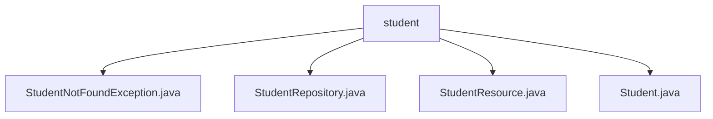

# 基础信息

|      |      |
|------|------|
| 名称 | student |
| 编码语言 | .java |
| 代码路径 | spring-boot-examples/spring-boot-2-rest-service-with-swagger/src/main/java/com/in28minutes/springboot/rest/example/student |
| 包名 | spring-boot-examples.spring-boot-2-rest-service-with-swagger.src.main.java.com.in28minutes.springboot.rest.example.student |
| 概述说明 | 自定义异常类处理学生未找到，学生资源控制器管理增删改查，学生类存储ID、姓名、护照号。 |

# 说明

## 概述
该代码模块是一个基于Spring Boot 2的RESTful服务示例，主要用于管理学生信息。模块包含多个关键组件，包括自定义异常类、学生资源控制器、学生数据存储库以及学生实体类。通过这些组件，模块实现了对学生信息的增删改查操作，并通过Swagger提供了API文档支持。

## 主要业务场景
1. **学生信息管理**：通过学生资源控制器（`StudentResource`），用户可以执行查询、删除、创建和更新学生信息的操作。这些操作通过REST API暴露，便于外部系统或前端应用调用。
2. **异常处理**：当系统尝试查找学生信息但未找到时，会抛出`StudentNotFoundException`异常。该自定义异常类用于精确捕捉和处理特定场景下的错误，提高代码的可读性和可维护性。
3. **数据存储与检索**：学生数据存储库（`StudentRepository`）负责与底层数据库交互，实现学生信息的持久化存储和检索。
4. **数据结构定义**：学生类（`Student`）定义了学生信息的数据结构，包含ID、姓名和护照号三个主要属性，确保学生信息的基本完整性和规范性。

### 包内部结构视图

该流程图展示了`student`目录下的文件结构，包括`StudentNotFoundException.java`、`StudentRepository.java`、`StudentResource.java`和`Student.java`四个文件。这些文件都直接位于`student`目录下，没有进一步的子目录层级，表明它们属于同一层级。这种结构常见于Spring Boot项目中，用于管理学生相关的异常、数据访问、资源处理和实体类。

# 文件列表 File List

| 名称   | 类型  | 说明 |
|-------|------|-------------|
| [StudentRepository.java](StudentRepository.md) | file | 输入信息为空，无法生成概要描述。 |
| [Student.java](Student.md) | file | 学生类含ID、姓名、护照号，姓名需至少2字符。 |
| [StudentResource.java](StudentResource.md) | file | 学生资源控制器提供增删改查学生信息的API。 |
| [StudentNotFoundException.java](StudentNotFoundException.md) | file | 自定义异常类用于处理学生未找到的情况。 |

