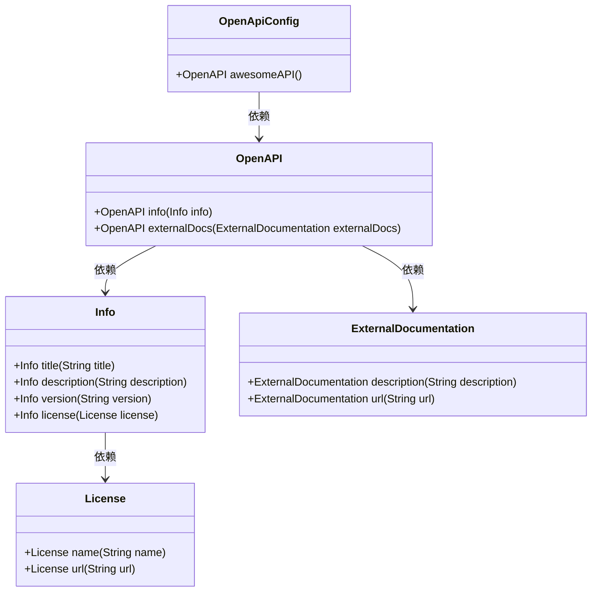
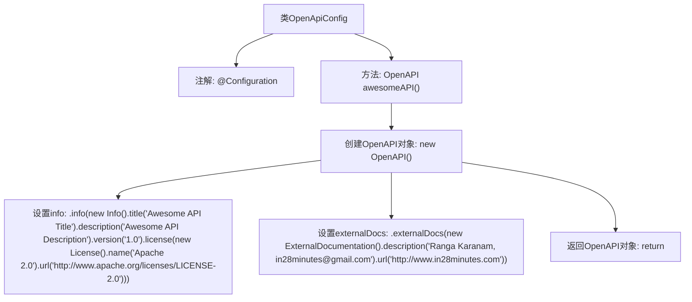

# 基础信息

|      |      |
|------|------|
| 名称 | OpenApiConfig |
| 编码语言 | .java |
| 代码路径 | spring-boot-examples/spring-boot-2-rest-service-with-swagger/src/main/java/com/in28minutes/springboot/rest/example/swagger/OpenApiConfig.java |
| 包名 | com.in28minutes.springboot.rest.example.swagger |
| 依赖项 | ['io.swagger.v3.oas.models.ExternalDocumentation', 'io.swagger.v3.oas.models.OpenAPI', 'io.swagger.v3.oas.models.info.Info', 'io.swagger.v3.oas.models.info.License', 'org.springframework.context.annotation.Bean', 'org.springframework.context.annotation.Configuration'] |
| 概述说明 | OpenApiConfig类创建OpenAPI实例，包含标题、描述、版本、许可证和外部文档。 |

# 说明

OpenApiConfig类定义了一个用于生成OpenAPI实例的Bean，该实例包含标题、描述、版本、许可证以及外部文档等关键信息。通过此类，开发者可以配置和定制OpenAPI文档的详细内容，确保API文档的完整性和可读性。

# 类列表 Class Summary

| 名称   | 类型  | 说明 |
|-------|------|-------------|
| OpenApiConfig | class | OpenApiConfig类定义了一个Bean，生成OpenAPI实例，包含标题、描述、版本、许可证和外部文档信息。 |

## 类 OpenApiConfig

|      |      |
|------|------|
| 访问范围 | @Configuration;public |
| 类型 | class |
| 名称 | OpenApiConfig |
| 说明 | OpenApiConfig类定义了一个Bean，生成OpenAPI实例，包含标题、描述、版本、许可证和外部文档信息。 |

### UML类图

**描述：**  
`OpenApiConfig` 类是一个配置类，用于定义 `OpenAPI` 实例。它通过 `awesomeAPI` 方法返回一个 `OpenAPI` 对象，该对象包含了 API 的基本信息（如标题、描述、版本、许可证）以及外部文档的链接。`OpenAPI` 类依赖于 `Info` 和 `ExternalDocumentation` 类来设置这些信息，而 `Info` 类又依赖于 `License` 类来定义许可证信息。整个类图展示了如何通过依赖关系构建一个完整的 OpenAPI 配置。

### 内部方法调用关系图

这段代码定义了一个配置类 `OpenApiConfig`，其中包含一个方法 `awesomeAPI()`，用于创建并返回一个 `OpenAPI` 对象。该方法通过链式调用设置了 `OpenAPI` 对象的 `info` 和 `externalDocs` 属性，分别包含API的标题、描述、版本、许可证信息以及外部文档的链接。最后，该方法返回配置好的 `OpenAPI` 对象。

### 字段列表 Field List

| 名称  | 类型  | 说明 |
|-------|-------|------|

### 方法列表 Method List

| 名称  | 类型  | 说明 |
|-------|-------|------|
| awesomeAPI | OpenAPI | 创建名为Awesome API的OpenAPI，版本1.0，使用Apache 2.0许可，提供外部文档链接。 |

