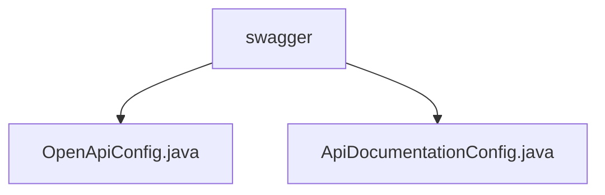

# 基础信息

|      |      |
|------|------|
| 名称 | swagger |
| 编码语言 | .java |
| 代码路径 | spring-boot-examples/spring-boot-2-rest-service-with-swagger/src/main/java/com/in28minutes/springboot/rest/example/swagger |
| 包名 | spring-boot-examples.spring-boot-2-rest-service-with-swagger.src.main.java.com.in28minutes.springboot.rest.example.swagger |
| 概述说明 | OpenApiConfig类用于配置OpenAPI实例，包含标题、描述、版本等信息，定制API文档。 |

# 说明

## 概述

该代码模块是一个基于Spring Boot 2的REST服务示例，集成了Swagger用于生成和管理OpenAPI文档。模块通过定义和配置相关的Bean，确保API文档的生成和展示符合开发者的需求，提供详细的API描述、版本信息、许可证等关键内容。开发者可以通过这些配置类定制API文档的外观和内容，确保文档的完整性和可读性。

## 主要业务场景

1. **OpenAPI文档生成与配置**：通过`OpenApiConfig`类，开发者可以生成一个包含标题、描述、版本、许可证以及外部文档等信息的OpenAPI实例。该配置类允许开发者灵活定制API文档的详细内容，确保生成的文档符合项目需求。

2. **Swagger集成与API文档展示**：`ApiDocumentationConfig`类负责配置Swagger的集成，确保API文档能够通过Swagger UI展示。开发者可以通过该配置类调整Swagger的展示方式，如启用或禁用某些功能，或者自定义UI的外观。

3. **REST服务的API文档管理**：该模块主要用于管理和展示REST服务的API文档，帮助开发者和其他利益相关者更好地理解和使用API。通过Swagger生成的OpenAPI文档，开发者可以快速查看API的详细信息，包括请求参数、响应格式、错误码等。

### 包内部结构视图

该流程图展示了`swagger`文件夹下的两个配置文件`OpenApiConfig.java`和`ApiDocumentationConfig.java`的层级关系。`swagger`作为根节点，包含了两个子节点，分别对应不同的配置文件。这种结构清晰地反映了文件在项目中的组织方式，便于开发者快速定位和管理相关文件。

# 文件列表 File List

| 名称   | 类型  | 说明 |
|-------|------|-------------|
| [ApiDocumentationConfig.java](ApiDocumentationConfig.md) | file | 无内容提供，无法生成概要描述。 |
| [OpenApiConfig.java](OpenApiConfig.md) | file | OpenApiConfig类创建OpenAPI实例，包含标题、描述、版本、许可证和外部文档。 |

