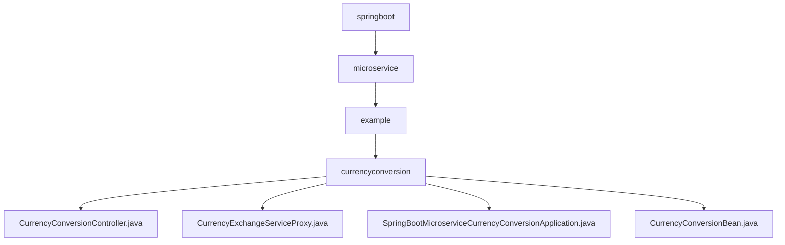

# 基础信息

|      |      |
|------|------|
| 名称 | springboot |
| 编码语言 | .java |
| 代码路径 | spring-boot-examples/spring-boot-basic-microservice/spring-boot-microservice-currency-conversion-service/src/main/java/com/in28minutes/springboot |
| 包名 | spring-boot-examples.spring-boot-basic-microservice.spring-boot-microservice-currency-conversion-service.src.main.java.com.in28minutes.springboot |
| 概述说明 | 控制器处理货币转换，支持RestTemplate和Feign获取汇率，计算转换金额，适用于不同场景。 |

# 说明

## 概述
该代码模块是一个基于Spring Boot的微服务应用，专注于货币转换功能。模块通过`CurrencyConversionController`处理货币转换请求，支持通过`RestTemplate`和`Feign`两种方式获取汇率信息，并基于获取的汇率计算转换后的金额。`CurrencyExchangeServiceProxy`集成了Feign客户端和服务发现功能，简化了HTTP API的调用，并支持动态发现和调用其他微服务实例。整个模块的设计旨在提高微服务架构中的通信效率和可扩展性。

## 主要业务场景
1. **货币转换请求处理**：`CurrencyConversionController`负责接收货币转换请求，支持通过`RestTemplate`和`Feign`两种方式获取汇率信息，并计算转换后的金额。
2. **远程服务调用**：`CurrencyExchangeServiceProxy`通过Feign客户端简化远程服务的调用，支持与服务注册中心（如Eureka或Consul）集成，实现动态服务发现和调用。
3. **微服务通信优化**：通过集成Feign和服务发现功能，模块能够高效地与其他微服务进行通信，提升系统的可扩展性和灵活性。

### 包内部结构视图

该流程图展示了`spring-boot-microservice-currency-conversion-service`项目的路径层级关系。从`springboot`开始，逐级深入到`microservice`、`example`和`currencyconversion`文件夹，最终列出了`currencyconversion`文件夹中的四个关键文件。这些文件包括控制器、服务代理、应用程序主类和实体类，构成了微服务的基本结构。

# 文件列表 File List

| 名称   | 类型  | 说明 |
|-------|------|-------------|
| [microservice](microservice/_module.md) | package | 控制器处理货币转换，支持RestTemplate和Feign获取汇率，计算转换金额，适用于不同场景。 |

