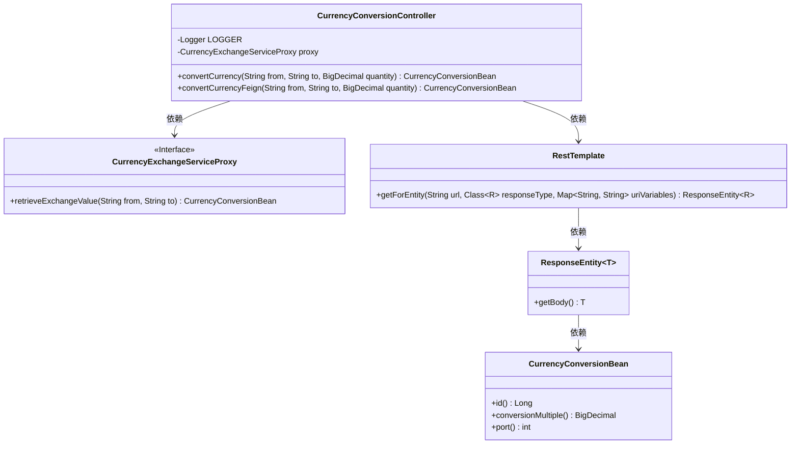
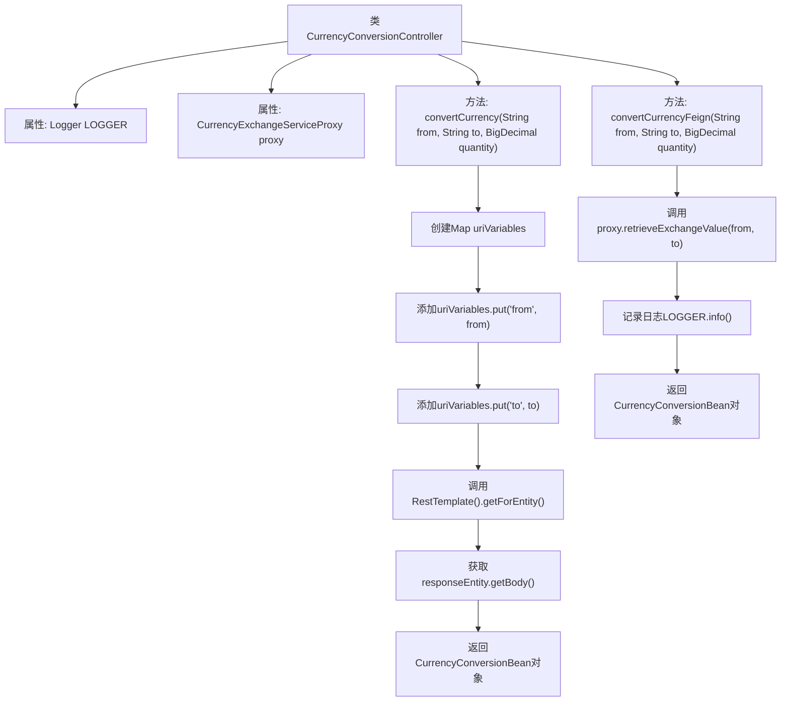

# 基础信息

|      |      |
|------|------|
| 名称 | CurrencyConversionController |
| 编码语言 | .java |
| 代码路径 | spring-boot-examples/spring-boot-basic-microservice/spring-boot-microservice-currency-conversion-service/src/main/java/com/in28minutes/springboot/microservice/example/currencyconversion/CurrencyConversionController.java |
| 包名 | com.in28minutes.springboot.microservice.example.currencyconversion |
| 依赖项 | ['java.math.BigDecimal', 'java.util.HashMap', 'java.util.Map', 'org.slf4j.Logger', 'org.slf4j.LoggerFactory', 'org.springframework.beans.factory.annotation.Autowired', 'org.springframework.http.ResponseEntity', 'org.springframework.web.bind.annotation.GetMapping', 'org.springframework.web.bind.annotation.PathVariable', 'org.springframework.web.bind.annotation.RestController', 'org.springframework.web.client.RestTemplate'] |
| 概述说明 | 控制器处理货币转换，支持RestTemplate和Feign获取汇率并计算金额。 |

# 说明

该控制器负责处理货币转换请求，支持通过RestTemplate和Feign两种方式获取汇率信息，并基于获取的汇率计算转换后的金额。这两种方式提供了灵活的选择，适用于不同的技术需求和场景，确保系统能够高效、准确地完成货币转换任务。

# 类列表 Class Summary

| 名称   | 类型  | 说明 |
|-------|------|-------------|
| CurrencyConversionController | class | 该控制器处理货币转换请求，支持通过RestTemplate和Feign两种方式获取汇率并计算转换金额。 |

## 类 CurrencyConversionController

|      |      |
|------|------|
| 访问范围 | @RestController;public |
| 类型 | class |
| 名称 | CurrencyConversionController |
| 说明 | 该控制器处理货币转换请求，支持通过RestTemplate和Feign两种方式获取汇率并计算转换金额。 |

### UML类图

这段代码展示了一个用于货币转换的控制器类 `CurrencyConversionController`，它通过两种方式实现货币转换：一种是直接使用 `RestTemplate` 调用外部服务，另一种是通过 `Feign` 客户端 `CurrencyExchangeServiceProxy` 调用服务。控制器接收货币代码和数量作为输入，返回转换后的金额。代码中使用了日志记录和依赖注入等技术，确保代码的可维护性和可扩展性。

### 内部方法调用关系图

**描述：**  
`CurrencyConversionController`类是一个REST控制器，提供了两个端点用于货币转换。`convertCurrency`方法通过`RestTemplate`调用外部服务获取汇率信息，并返回转换后的货币值。`convertCurrencyFeign`方法通过`Feign`客户端`proxy`获取汇率信息，并记录日志后返回转换后的货币值。两个方法都通过`CurrencyConversionBean`对象封装和返回结果。

### 字段列表 Field List

| 名称  | 类型  | 说明 |
|-------|-------|------|
| proxy | CurrencyExchangeServiceProxy | 自动注入货币兑换服务代理实例。 |
| LOGGER = LoggerFactory.getLogger(this.getClass()) | Logger | 定义私有日志记录器LOGGER，用于当前类日志输出。 |

### 方法列表 Method List

| 名称  | 类型  | 说明 |
|-------|-------|------|
| convertCurrencyFeign | CurrencyConversionBean | 通过Feign客户端实现货币转换，返回转换结果。 |
| convertCurrency | CurrencyConversionBean | GET请求转换货币，接收来源、目标和数量，返回转换结果。 |

