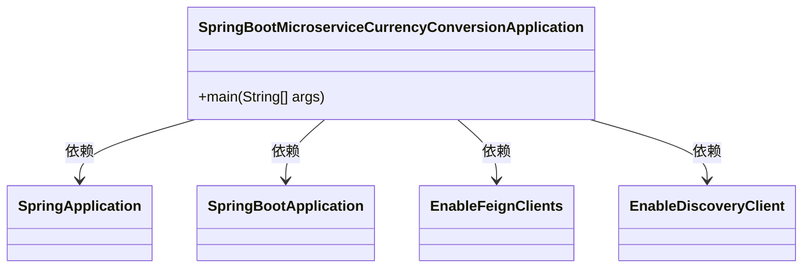
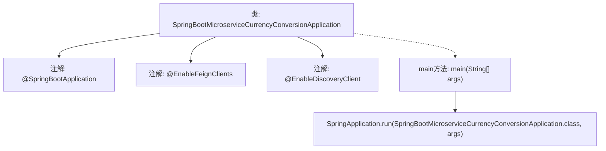

# 基础信息

|      |      |
|------|------|
| 名称 | SpringBootMicroserviceCurrencyConversionApplication |
| 编码语言 | .java |
| 代码路径 | spring-boot-examples/spring-boot-basic-microservice/spring-boot-microservice-currency-conversion-service/src/main/java/com/in28minutes/springboot/microservice/example/currencyconversion/SpringBootMicroserviceCurrencyConversionApplication.java |
| 包名 | com.in28minutes.springboot.microservice.example.currencyconversion |
| 依赖项 | ['org.springframework.boot.SpringApplication', 'org.springframework.boot.autoconfigure.SpringBootApplication', 'org.springframework.cloud.client.discovery.EnableDiscoveryClient', 'org.springframework.cloud.openfeign.EnableFeignClients'] |
| 概述说明 | Spring Boot应用启用Feign客户端和服务发现功能。 |

# 说明

Spring Boot应用集成了Feign客户端和服务发现功能。Feign客户端用于简化HTTP API的调用，通过声明式接口实现远程服务的调用。服务发现功能使得应用能够动态地发现和调用其他微服务实例，通常与Eureka或Consul等服务注册中心结合使用。这种配置提高了微服务架构中的通信效率和可扩展性。

# 类列表 Class Summary

| 名称   | 类型  | 说明 |
|-------|------|-------------|
| SpringBootMicroserviceCurrencyConversionApplication | class | Spring Boot应用，启用Feign客户端和服务发现。 |

## 类 SpringBootMicroserviceCurrencyConversionApplication

|      |      |
|------|------|
| 访问范围 | @SpringBootApplication;@EnableFeignClients("com.in28minutes.springboot.microservice.example.currencyconversion");@EnableDiscoveryClient;public |
| 类型 | class |
| 名称 | SpringBootMicroserviceCurrencyConversionApplication |
| 说明 | Spring Boot应用，启用Feign客户端和服务发现。 |

### UML类图

这段代码定义了一个名为 `SpringBootMicroserviceCurrencyConversionApplication` 的类，它是一个Spring Boot应用程序的入口类。该类使用了 `@SpringBootApplication` 注解来标记它是一个Spring Boot应用，并通过 `@EnableFeignClients` 注解启用了Feign客户端，用于调用其他微服务。`@EnableDiscoveryClient` 注解则启用了服务发现功能，使得该应用能够注册到服务注册中心。`main` 方法是应用的启动入口，通过 `SpringApplication.run` 方法启动应用。

### 内部方法调用关系图

这段代码是一个Spring Boot应用程序的入口类，使用了`@SpringBootApplication`注解来标记主类，并启用了Feign客户端和服务发现功能。`main`方法通过`SpringApplication.run`启动Spring Boot应用。流程图展示了类的注解和主方法之间的关系，清晰地描述了应用程序的启动流程。

### 字段列表 Field List

| 名称  | 类型  | 说明 |
|-------|-------|------|

### 方法列表 Method List

| 名称  | 类型  | 说明 |
|-------|-------|------|
| main | void | 启动Spring Boot微服务应用的主方法。 |

