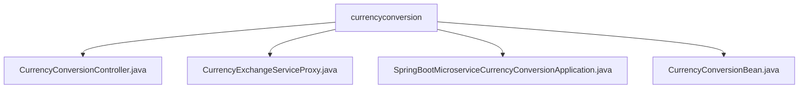

# 基础信息

|      |      |
|------|------|
| 名称 | currencyconversion |
| 编码语言 | .java |
| 代码路径 | spring-boot-examples/spring-boot-basic-microservice/spring-boot-microservice-currency-conversion-service/src/main/java/com/in28minutes/springboot/microservice/example/currencyconversion |
| 包名 | spring-boot-examples.spring-boot-basic-microservice.spring-boot-microservice-currency-conversion-service.src.main.java.com.in28minutes.springboot.microservice.example.currencyconversion |
| 概述说明 | 控制器处理货币转换，支持RestTemplate和Feign获取汇率，计算转换金额，适用于不同场景。 |

# 说明

## 概述
该代码模块是一个基于Spring Boot的微服务应用，专注于货币转换功能。模块通过`CurrencyConversionController`处理货币转换请求，支持通过`RestTemplate`和`Feign`两种方式获取汇率信息，并基于获取的汇率计算转换后的金额。`CurrencyExchangeServiceProxy`集成了Feign客户端和服务发现功能，简化了HTTP API的调用，并支持动态发现和调用其他微服务实例。整个模块的设计旨在提高微服务架构中的通信效率和可扩展性。

## 主要业务场景
1. **货币转换请求处理**：`CurrencyConversionController`负责接收货币转换请求，支持通过`RestTemplate`和`Feign`两种方式获取汇率信息，并计算转换后的金额。
2. **远程服务调用**：`CurrencyExchangeServiceProxy`通过Feign客户端简化远程服务的调用，支持与服务注册中心（如Eureka或Consul）集成，实现动态服务发现和调用。
3. **微服务通信优化**：通过集成Feign和服务发现功能，模块能够高效地与其他微服务进行通信，提升系统的可扩展性和灵活性。

### 包内部结构视图

该流程图展示了`currencyconversion`目录下的文件结构。`currencyconversion`作为根节点，包含了四个子节点，分别是`CurrencyConversionController.java`、`CurrencyExchangeServiceProxy.java`、`SpringBootMicroserviceCurrencyConversionApplication.java`和`CurrencyConversionBean.java`。这些文件共同构成了一个基本的微服务应用的核心组件。

# 文件列表 File List

| 名称   | 类型  | 说明 |
|-------|------|-------------|
| [SpringBootMicroserviceCurrencyConversionApplication.java](SpringBootMicroserviceCurrencyConversionApplication.md) | file | Spring Boot应用启用Feign客户端和服务发现功能。 |
| [CurrencyExchangeServiceProxy.java](CurrencyExchangeServiceProxy.md) | file | 无内容提供，无法生成概要描述。 |
| [CurrencyConversionController.java](CurrencyConversionController.md) | file | 控制器处理货币转换，支持RestTemplate和Feign获取汇率并计算金额。 |
| [CurrencyConversionBean.java](CurrencyConversionBean.md) | file | 信息为空，无法生成概要描述。 |

