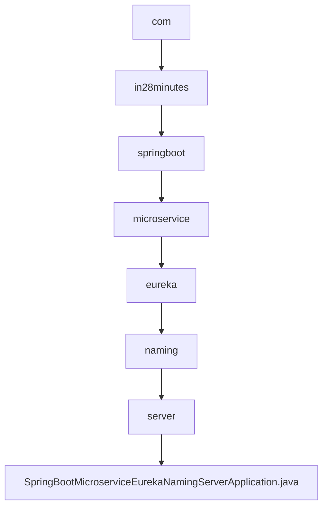

# 基础信息

|      |      |
|------|------|
| 名称 | com |
| 编码语言 | .java |
| 代码路径 | spring-boot-examples/spring-boot-basic-microservice/spring-boot-microservice-eureka-naming-server/src/main/java/com |
| 包名 | spring-boot-examples.spring-boot-basic-microservice.spring-boot-microservice-eureka-naming-server.src.main.java.com |
| 概述说明 | Spring Boot应用启用Eureka服务注册中心。 |

# 说明

Spring Boot应用通过启用Eureka服务注册中心，实现了微服务架构中的服务注册与发现功能。Eureka作为服务注册中心，负责管理所有微服务的实例信息，使得服务之间能够动态地发现和调用彼此。Spring Boot应用通过简单的配置和依赖引入，即可轻松集成Eureka，从而提升系统的可扩展性和维护性。这一机制确保了微服务架构中的高可用性和负载均衡，简化了服务治理的复杂性。

### 包内部结构视图

该流程图展示了Spring Boot微服务Eureka命名服务器项目的层级结构。从根目录`com`开始，逐级深入到`in28minutes`、`springboot`、`microservice`、`eureka`、`naming`和`server`，最终到达应用程序主类`SpringBootMicroserviceEurekaNamingServerApplication.java`。每个节点代表路径中的一个文件夹或文件，清晰地展示了项目的组织结构。

# 文件列表 File List

| 名称   | 类型  | 说明 |
|-------|------|-------------|
| [in28minutes](in28minutes/_module.md) | package | Spring Boot应用启用Eureka服务注册中心。 |

