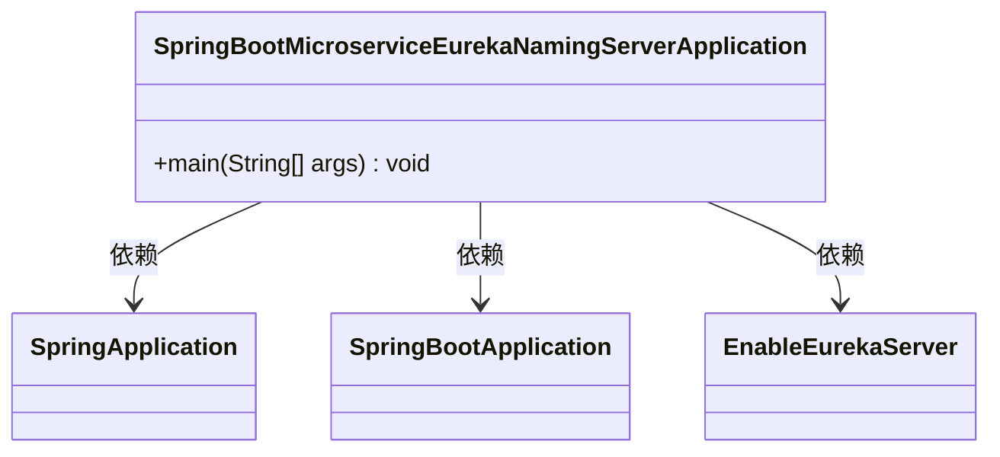
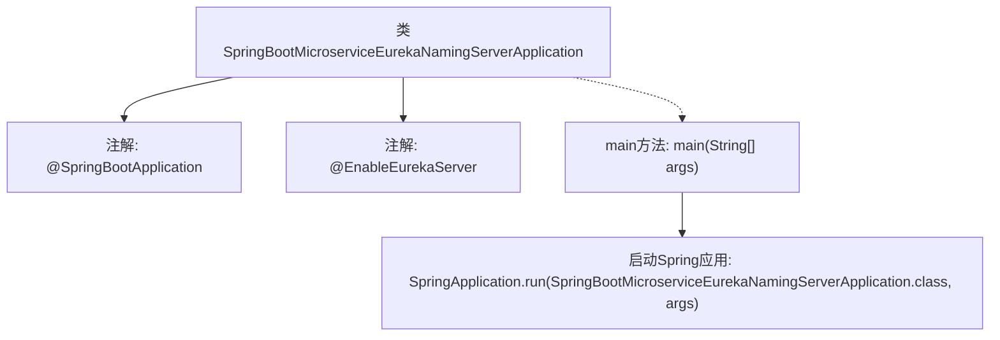

# 基础信息

|      |      |
|------|------|
| 名称 | SpringBootMicroserviceEurekaNamingServerApplication |
| 编码语言 | .java |
| 代码路径 | spring-boot-examples/spring-boot-basic-microservice/spring-boot-microservice-eureka-naming-server/src/main/java/com/in28minutes/springboot/microservice/eureka/naming/server/SpringBootMicroserviceEurekaNamingServerApplication.java |
| 包名 | com.in28minutes.springboot.microservice.eureka.naming.server |
| 依赖项 | ['org.springframework.boot.SpringApplication', 'org.springframework.boot.autoconfigure.SpringBootApplication', 'org.springframework.cloud.netflix.eureka.server.EnableEurekaServer'] |
| 概述说明 | Spring Boot应用启用Eureka服务注册中心。 |

# 说明

Spring Boot应用通过启用Eureka服务注册中心，实现了微服务架构中的服务注册与发现功能。Eureka作为服务注册中心，负责管理所有微服务的实例信息，使得服务之间能够动态地发现和调用彼此。Spring Boot应用通过简单的配置和依赖引入，即可轻松集成Eureka，从而提升系统的可扩展性和维护性。这一机制确保了微服务架构中的高可用性和负载均衡，简化了服务治理的复杂性。

# 类列表 Class Summary

| 名称   | 类型  | 说明 |
|-------|------|-------------|
| SpringBootMicroserviceEurekaNamingServerApplication | class | Spring Boot应用启用Eureka服务注册中心。 |

## 类 SpringBootMicroserviceEurekaNamingServerApplication

|      |      |
|------|------|
| 访问范围 | @SpringBootApplication;@EnableEurekaServer;public |
| 类型 | class |
| 名称 | SpringBootMicroserviceEurekaNamingServerApplication |
| 说明 | Spring Boot应用启用Eureka服务注册中心。 |

### UML类图

**描述：**  
`SpringBootMicroserviceEurekaNamingServerApplication` 是一个使用 Spring Boot 框架的微服务应用，它通过 `@SpringBootApplication` 注解标记为主应用类，并通过 `@EnableEurekaServer` 注解启用 Eureka 服务注册中心功能。`main` 方法启动 Spring 应用，依赖 `SpringApplication` 类来运行应用。

### 内部方法调用关系图

这段代码定义了一个Spring Boot微服务应用，使用`@SpringBootApplication`注解标记为主应用类，并通过`@EnableEurekaServer`注解启用Eureka服务注册中心。`main`方法通过`SpringApplication.run`启动应用，传入当前类作为参数，以初始化并运行Spring Boot应用。流程图展示了类与注解的关系以及`main`方法的执行流程。

### 字段列表 Field List

| 名称  | 类型  | 说明 |
|-------|-------|------|

### 方法列表 Method List

| 名称  | 类型  | 说明 |
|-------|-------|------|
| main | void | Java主方法启动Spring Boot微服务Eureka命名服务器。 |

