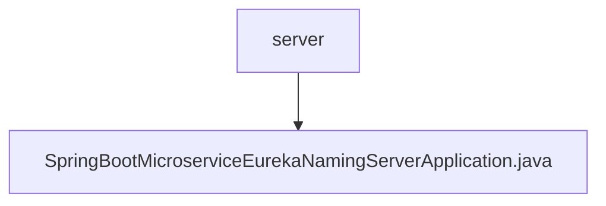

# 基础信息

|      |      |
|------|------|
| 名称 | server |
| 编码语言 | .java |
| 代码路径 | spring-boot-examples/spring-boot-basic-microservice/spring-boot-microservice-eureka-naming-server/src/main/java/com/in28minutes/springboot/microservice/eureka/naming/server |
| 包名 | spring-boot-examples.spring-boot-basic-microservice.spring-boot-microservice-eureka-naming-server.src.main.java.com.in28minutes.springboot.microservice.eureka.naming.server |
| 概述说明 | Spring Boot应用启用Eureka服务注册中心。 |

# 说明

Spring Boot应用通过启用Eureka服务注册中心，实现了微服务架构中的服务注册与发现功能。Eureka作为服务注册中心，负责管理所有微服务的实例信息，使得服务之间能够动态地发现和调用彼此。Spring Boot应用通过简单的配置和依赖引入，即可轻松集成Eureka，从而提升系统的可扩展性和维护性。这一机制确保了微服务架构中的高可用性和负载均衡，简化了服务治理的复杂性。

### 包内部结构视图

该流程图展示了路径的层级关系，根节点为`server`，其下包含一个文件节点`SpringBootMicroserviceEurekaNamingServerApplication.java`。路径结构简洁明了，反映了文件在项目中的具体位置。

# 文件列表 File List

| 名称   | 类型  | 说明 |
|-------|------|-------------|
| [SpringBootMicroserviceEurekaNamingServerApplication.java](SpringBootMicroserviceEurekaNamingServerApplication.md) | file | Spring Boot应用启用Eureka服务注册中心。 |

