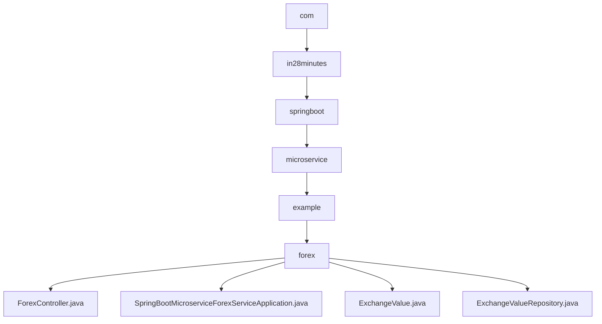

# 基础信息

|      |      |
|------|------|
| 名称 | com |
| 编码语言 | .java |
| 代码路径 | spring-boot-examples/spring-boot-basic-microservice/spring-boot-microservice-forex-service/src/main/java/com |
| 包名 | spring-boot-examples.spring-boot-basic-microservice.spring-boot-microservice-forex-service.src.main.java.com |
| 概述说明 | ForexController获取货币兑换值，ExchangeValue定义转换信息，Spring Boot应用处理外汇业务。 |

# 说明

## 概述
该代码模块是一个基于Spring Boot框架开发的微服务系统，专门用于处理外汇相关业务。系统通过REST API获取最新的货币兑换数据，并确保端口的正确配置以便于数据传输和通信。模块启用了服务发现功能，能够自动识别和管理各个微服务的实例，确保服务之间的高效通信和协调。通过服务发现，系统能够动态调整服务实例的注册与注销，提升整体的可扩展性和可靠性。

## 主要业务场景
1. **货币兑换请求处理**：`ForexController`类通过REST API处理与外汇兑换相关的请求，获取最新的货币兑换数据，并确保端口的正确配置以便于数据传输和通信。
2. **服务发现与管理**：Spring Boot微服务外汇应用启用了服务发现功能，能够自动识别和管理各个微服务的实例，确保服务之间的高效通信和协调。
3. **货币转换信息定义**：`ExchangeValue`类用于定义货币转换的相关信息，包含ID、源货币、目标货币、转换率和端口字段，便于在系统中进行管理和操作。

### 包内部结构视图

该流程图展示了从根目录 `com` 到 `forex` 文件夹的层级关系，以及 `forex` 文件夹中包含的四个文件。路径层级清晰，从顶层目录逐步深入到具体的文件和子文件夹，体现了项目的结构化和模块化设计。

# 文件列表 File List

| 名称   | 类型  | 说明 |
|-------|------|-------------|
| [in28minutes](in28minutes/_module.md) | package | ForexController获取货币兑换值，ExchangeValue定义转换信息，Spring Boot应用处理外汇业务。 |

