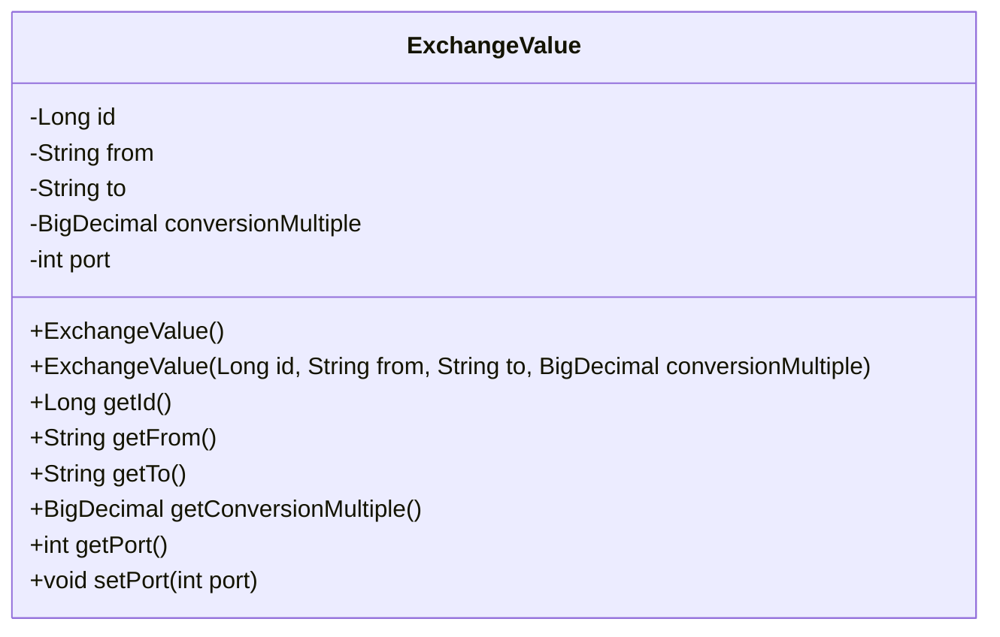
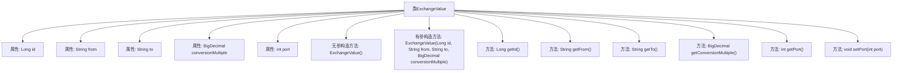

# 基础信息

|      |      |
|------|------|
| 名称 | ExchangeValue |
| 编码语言 | .java |
| 代码路径 | spring-boot-examples/spring-boot-basic-microservice/spring-boot-microservice-forex-service/src/main/java/com/in28minutes/springboot/microservice/example/forex/ExchangeValue.java |
| 包名 | com.in28minutes.springboot.microservice.example.forex |
| 依赖项 | ['java.math.BigDecimal', 'jakarta.persistence.Column', 'jakarta.persistence.Entity', 'jakarta.persistence.Id'] |
| 概述说明 | ExchangeValue类定义货币转换信息，含ID、源货币、目标货币、转换率和端口字段。 |

# 说明

ExchangeValue类用于定义货币转换的相关信息，包含五个关键字段：ID用于唯一标识每个转换记录，源货币表示转换前的货币类型，目标货币表示转换后的货币类型，转换率用于计算两种货币之间的兑换比例，端口字段则用于标识与转换相关的服务端口。该类结构清晰，涵盖了货币转换所需的核心数据，便于在系统中进行管理和操作。

# 类列表 Class Summary

| 名称   | 类型  | 说明 |
|-------|------|-------------|
| ExchangeValue | class | ExchangeValue类定义货币转换信息，包含ID、源货币、目标货币、转换率和端口字段。 |

## 类 ExchangeValue

|      |      |
|------|------|
| 访问范围 | @Entity;public |
| 类型 | class |
| 名称 | ExchangeValue |
| 说明 | ExchangeValue类定义货币转换信息，包含ID、源货币、目标货币、转换率和端口字段。 |

### UML类图

**描述：**  
`ExchangeValue` 类是一个实体类，用于表示货币兑换的值。它包含 `id`、`from`（源货币）、`to`（目标货币）、`conversionMultiple`（兑换比率）和 `port`（端口号）等私有属性。类提供了默认构造函数和带参数的构造函数，以及用于获取和设置这些属性的公有方法。该类通过 `@Entity` 注解标记为 JPA 实体，并通过 `@Id` 和 `@Column` 注解映射到数据库表。

### 内部方法调用关系图

这段代码定义了一个名为`ExchangeValue`的实体类，用于表示货币兑换的相关信息。类中包含多个属性，如`id`、`from`、`to`、`conversionMultiple`和`port`，并提供了相应的构造方法和getter/setter方法。流程图展示了类与其属性和方法之间的关系，帮助理解类的结构和功能。

### 字段列表 Field List

| 名称  | 类型  | 说明 |
|-------|-------|------|
| id | Long | 类中包含一个私有的长整型ID字段。 |
| port | int | 私有整型变量port。 |
| conversionMultiple | BigDecimal | 私有BigDecimal类型变量conversionMultiple。 |
| to | String | 数据库列"currency_to"映射到字符串类型变量"to"。 |
| from | String | 数据库列名为currency_from，对应私有变量from。 |

### 方法列表 Method List

| 名称  | 类型  | 说明 |
|-------|-------|------|
| getId | Long | 获取ID值的Java方法。 |
| setPort | void | 设置端口号的公共方法。 |
| getPort | int | 获取端口号的方法，返回整数类型的端口值。 |
| getFrom | String | 该方法返回字符串类型的from变量值。 |
| getConversionMultiple | BigDecimal | 获取转换倍数值的方法。 |
| getTo | String | 获取目标对象的方法。 |

