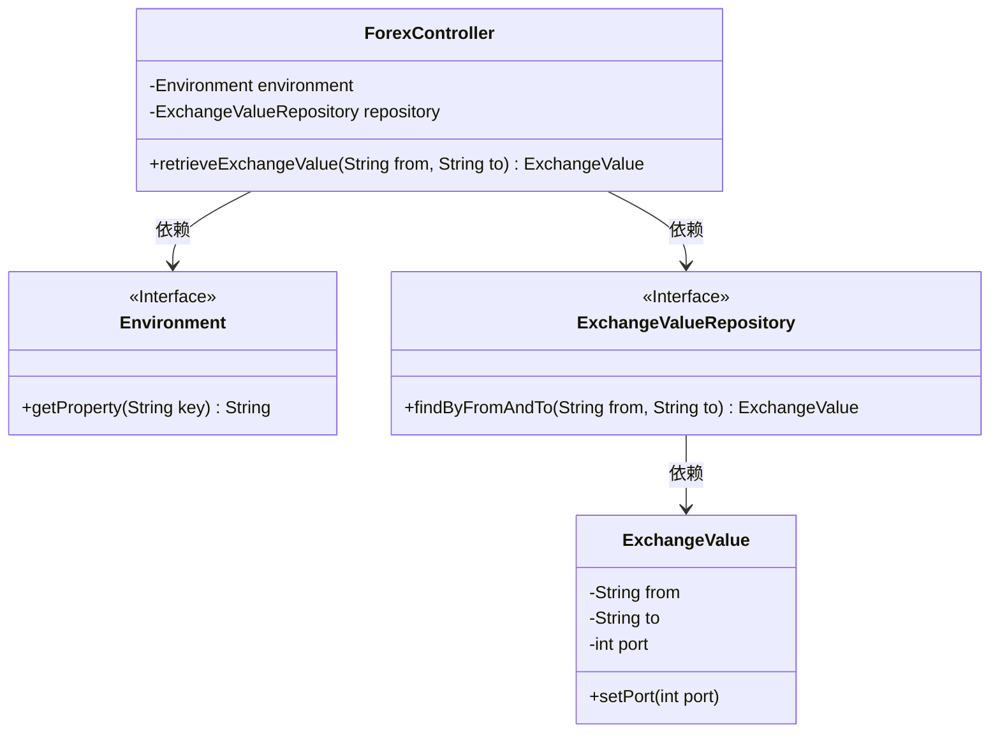
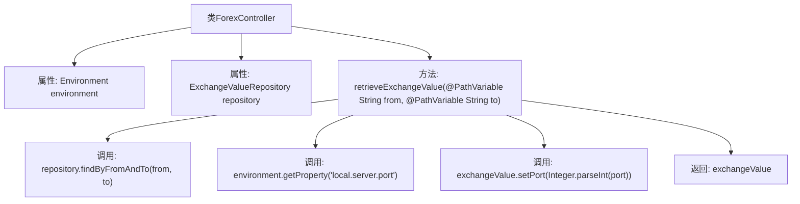

# 基础信息

|      |      |
|------|------|
| 名称 | ForexController |
| 编码语言 | .java |
| 代码路径 | spring-boot-examples/spring-boot-basic-microservice/spring-boot-microservice-forex-service/src/main/java/com/in28minutes/springboot/microservice/example/forex/ForexController.java |
| 包名 | com.in28minutes.springboot.microservice.example.forex |
| 依赖项 | ['org.springframework.beans.factory.annotation.Autowired', 'org.springframework.core.env.Environment', 'org.springframework.web.bind.annotation.GetMapping', 'org.springframework.web.bind.annotation.PathVariable', 'org.springframework.web.bind.annotation.RestController'] |
| 概述说明 | ForexController类通过REST API获取货币兑换值并配置端口。 |

# 说明

ForexController类通过REST API获取货币兑换值，并负责设置端口。该类的主要功能是处理与外汇兑换相关的请求，通过REST API获取最新的货币兑换数据，并确保端口的正确配置以便于数据传输和通信。

# 类列表 Class Summary

| 名称   | 类型  | 说明 |
|-------|------|-------------|
| ForexController | class | ForexController类通过REST API获取货币兑换值并设置端口。 |

## 类 ForexController

|      |      |
|------|------|
| 访问范围 | @RestController;public |
| 类型 | class |
| 名称 | ForexController |
| 说明 | ForexController类通过REST API获取货币兑换值并设置端口。 |

### UML类图

类图描述：  
`ForexController` 是一个Spring Boot的REST控制器，负责处理外汇兑换请求。它依赖于 `Environment` 接口获取本地服务器端口，并依赖于 `ExchangeValueRepository` 接口从数据库中查询汇率信息。`ExchangeValue` 类表示汇率值，包含源货币、目标货币和端口号信息。`ForexController` 通过调用 `ExchangeValueRepository` 的 `findByFromAndTo` 方法获取汇率，并设置端口号后返回。

### 内部方法调用关系图

这段代码是一个Spring Boot的控制器类`ForexController`，用于处理外汇兑换的请求。它通过`@GetMapping`注解定义了一个RESTful API端点，接收两个路径参数`from`和`to`，表示货币的兑换来源和目标。控制器通过`ExchangeValueRepository`查找对应的汇率信息，并从`Environment`中获取本地服务器端口号，将其设置到`ExchangeValue`对象中，最后返回该对象。

### 字段列表 Field List

| 名称  | 类型  | 说明 |
|-------|-------|------|
| repository | ExchangeValueRepository | 自动注入ExchangeValueRepository实例。 |
| environment | Environment | 自动注入环境变量实例。 |

### 方法列表 Method List

| 名称  | 类型  | 说明 |
|-------|-------|------|
| retrieveExchangeValue | ExchangeValue | 通过路径参数获取货币汇率并设置端口号后返回。 |

