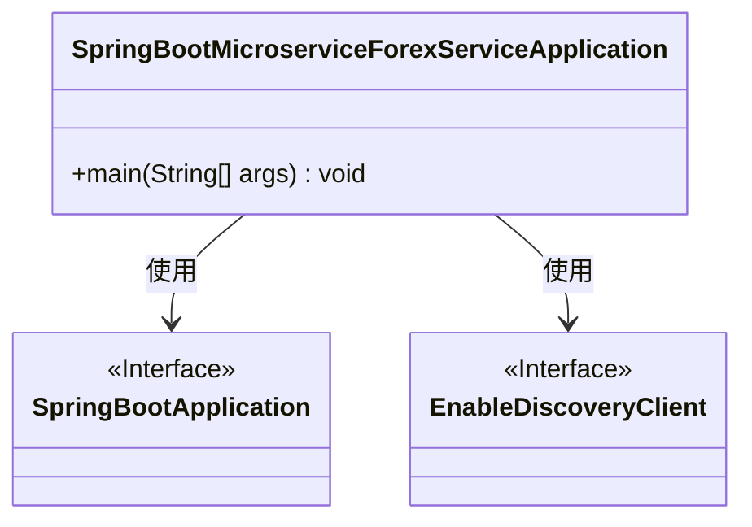
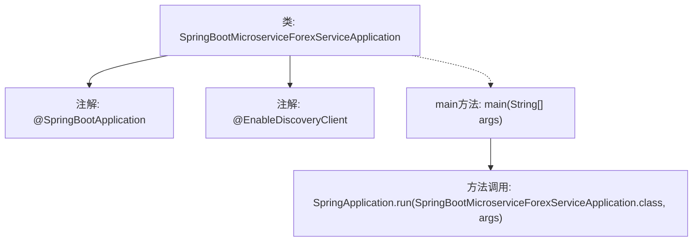

# 基础信息

|      |      |
|------|------|
| 名称 | SpringBootMicroserviceForexServiceApplication |
| 编码语言 | .java |
| 代码路径 | spring-boot-examples/spring-boot-basic-microservice/spring-boot-microservice-forex-service/src/main/java/com/in28minutes/springboot/microservice/example/forex/SpringBootMicroserviceForexServiceApplication.java |
| 包名 | com.in28minutes.springboot.microservice.example.forex |
| 依赖项 | ['org.springframework.boot.SpringApplication', 'org.springframework.boot.autoconfigure.SpringBootApplication', 'org.springframework.cloud.client.discovery.EnableDiscoveryClient'] |
| 概述说明 | Spring Boot微服务外汇应用，具备服务发现功能。 |

# 说明

Spring Boot微服务外汇应用是一个基于Spring Boot框架开发的微服务系统，专门用于处理外汇相关业务。该应用启用了服务发现功能，能够自动识别和管理各个微服务的实例，确保服务之间的高效通信和协调。通过服务发现，系统能够动态调整服务实例的注册与注销，提升整体的可扩展性和可靠性。这一功能使得外汇应用在面对高并发和复杂业务场景时，能够保持稳定的性能和高效的资源利用。

# 类列表 Class Summary

| 名称   | 类型  | 说明 |
|-------|------|-------------|
| SpringBootMicroserviceForexServiceApplication | class | Spring Boot微服务外汇应用，启用服务发现功能。 |

## 类 SpringBootMicroserviceForexServiceApplication

|      |      |
|------|------|
| 访问范围 | @SpringBootApplication;@EnableDiscoveryClient;public |
| 类型 | class |
| 名称 | SpringBootMicroserviceForexServiceApplication |
| 说明 | Spring Boot微服务外汇应用，启用服务发现功能。 |

### UML类图

这段代码定义了一个名为 `SpringBootMicroserviceForexServiceApplication` 的类，该类使用了 `@SpringBootApplication` 和 `@EnableDiscoveryClient` 注解。`@SpringBootApplication` 是一个组合注解，用于标记主类，启动 Spring Boot 应用。`@EnableDiscoveryClient` 用于启用服务发现功能。`main` 方法是应用的入口点，通过 `SpringApplication.run` 启动应用。

### 内部方法调用关系图

这段代码定义了一个名为 `SpringBootMicroserviceForexServiceApplication` 的类，该类使用了 `@SpringBootApplication` 和 `@EnableDiscoveryClient` 注解，表明这是一个Spring Boot应用并启用了服务发现功能。`main` 方法中调用了 `SpringApplication.run` 方法，启动Spring Boot应用并加载当前类作为主配置类。整个流程简洁明了，展示了Spring Boot应用的启动过程。

### 字段列表 Field List

| 名称  | 类型  | 说明 |
|-------|-------|------|

### 方法列表 Method List

| 名称  | 类型  | 说明 |
|-------|-------|------|
| main | void | Spring Boot 启动微服务应用主类。 |

