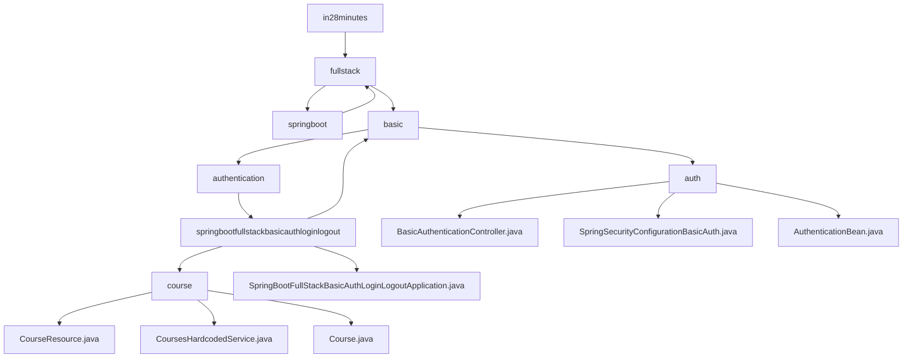

# 基础信息

|      |      |
|------|------|
| 名称 | in28minutes |
| 编码语言 | .java |
| 代码路径 | spring-boot-examples/spring-boot-react-examples/spring-boot-react-basic-auth-login-logout/backend-spring-boot-react-basic-auth-login-logout/src/main/java/com/in28minutes |
| 包名 | spring-boot-examples.spring-boot-react-examples.spring-boot-react-basic-auth-login-logout.backend-spring-boot-react-basic-auth-login-logout.src.main.java.com.in28minutes |
| 概述说明 | 基于Spring Boot和React的全栈应用，实现用户认证、跨域访问和课程管理功能。 |

# 说明

## 概述
该代码模块是一个基于Spring Boot和React的全栈应用示例，主要实现了基本的用户认证（登录/注销）功能，并提供了课程信息的管理与展示。模块通过跨域配置确保前后端在不同端口（3000和4200）之间的数据传输顺畅，从而支持用户课程信息的查询与展示。模块的核心功能包括用户认证、课程数据的静态提供以及课程信息的展示。通过集成Spring Security框架，应用能够对用户进行身份验证，确保只有经过认证的用户才能访问受保护的资源。

## 主要业务场景
1. **跨域访问与数据传输**：模块允许从本地3000和4200端口进行跨域访问，确保前后端之间的数据传输顺畅，主要用于获取指定用户名的课程列表。跨域控制器负责处理本地请求，并返回相应的认证信息。
2. **课程数据管理**：通过`CoursesHardcodedService`类，模块提供了预定义的静态课程列表，包含与Spring Boot、Angular、React、微服务以及云部署相关的课程内容，方便用户访问和学习这些技术相关的课程。
3. **用户认证**：模块实现了基本的用户认证功能，支持用户的登录和注销操作，确保只有经过认证的用户可以访问课程信息。认证方式采用HTTP基本认证，确保只有经过验证的用户才能访问受保护的资源。
4. **课程信息展示**：通过`CourseResource`类，模块提供了课程信息的查询接口，支持用户获取并展示相关课程内容。

### 包内部结构视图

该流程图展示了Spring Boot项目中从根目录`in28minutes`到各个子目录和文件的层级关系。`in28minutes`下包含`fullstack`目录，`fullstack`下包含`springboot`目录，依此类推，直到最终的Java文件。这些文件包括`CourseResource.java`、`CoursesHardcodedService.java`、`Course.java`等，以及`BasicAuthenticationController.java`、`SpringSecurityConfigurationBasicAuth.java`和`AuthenticationBean.java`等与认证相关的文件。

# 文件列表 File List

| 名称   | 类型  | 说明 |
|-------|------|-------------|
| [fullstack](fullstack/_module.md) | package | 基于Spring Boot和React的全栈应用，实现用户认证、跨域访问和课程管理功能。 |

