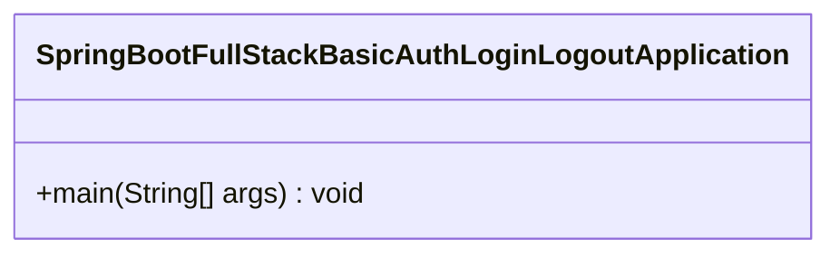
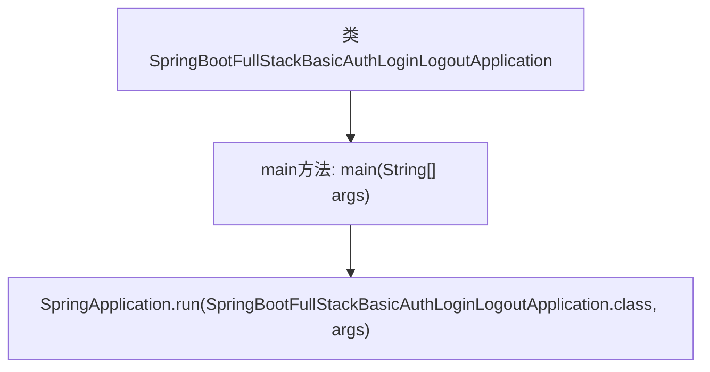

# 基础信息

|      |      |
|------|------|
| 名称 | SpringBootFullStackBasicAuthLoginLogoutApplication |
| 编码语言 | .java |
| 代码路径 | spring-boot-examples/spring-boot-react-examples/spring-boot-react-basic-auth-login-logout/backend-spring-boot-react-basic-auth-login-logout/src/main/java/com/in28minutes/fullstack/springboot/fullstack/basic/authentication/springbootfullstackbasicauthloginlogout/SpringBootFullStackBasicAuthLoginLogoutApplication.java |
| 包名 | com.in28minutes.fullstack.springboot.fullstack.basic.authentication.springbootfullstackbasicauthloginlogout |
| 依赖项 | ['org.springframework.boot.SpringApplication', 'org.springframework.boot.autoconfigure.SpringBootApplication'] |
| 概述说明 | Spring Boot实现登录与注销的基本认证功能。 |

# 说明

Spring Boot应用实现了基本的认证功能，包括用户登录与注销。通过集成Spring Security框架，应用能够对用户进行身份验证，确保只有经过认证的用户才能访问受保护的资源。登录功能通过用户名和密码进行验证，验证成功后用户将获得访问权限。注销功能则允许用户安全地退出系统，清除其认证信息并终止会话。整个认证过程确保了应用的安全性和用户数据的保护。

# 类列表 Class Summary

| 名称   | 类型  | 说明 |
|-------|------|-------------|
| SpringBootFullStackBasicAuthLoginLogoutApplication | class | Spring Boot应用实现基本认证的登录与注销功能。 |

## 类 SpringBootFullStackBasicAuthLoginLogoutApplication

|      |      |
|------|------|
| 访问范围 | @SpringBootApplication;public |
| 类型 | class |
| 名称 | SpringBootFullStackBasicAuthLoginLogoutApplication |
| 说明 | Spring Boot应用实现基本认证的登录与注销功能。 |

### UML类图

这段代码定义了一个名为 `SpringBootFullStackBasicAuthLoginLogoutApplication` 的类，该类使用了 `@SpringBootApplication` 注解，表明这是一个Spring Boot应用程序的入口类。类中包含一个 `main` 方法，该方法通过调用 `SpringApplication.run` 方法来启动Spring Boot应用程序。这个类是整个应用程序的启动点，负责初始化Spring Boot框架并运行应用程序。

### 内部方法调用关系图

这段代码是一个Spring Boot应用程序的入口类，使用`@SpringBootApplication`注解标记，表示这是一个Spring Boot应用。`main`方法是程序的启动入口，调用`SpringApplication.run`方法来启动Spring Boot应用，并传递当前类和应用参数。这个流程展示了Spring Boot应用的启动过程，从主类的定义到应用的启动执行。

### 字段列表 Field List

| 名称  | 类型  | 说明 |
|-------|-------|------|

### 方法列表 Method List

| 名称  | 类型  | 说明 |
|-------|-------|------|
| main | void | Spring Boot应用启动主类，运行基本认证登录注销功能。 |

