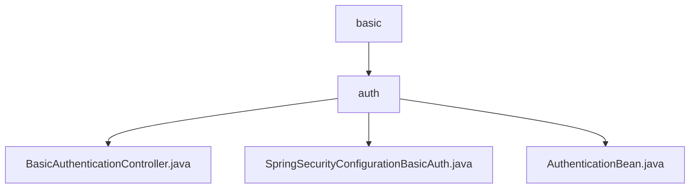

# 基础信息

|      |      |
|------|------|
| 名称 | basic |
| 编码语言 | .java |
| 代码路径 | spring-boot-examples/spring-boot-react-examples/spring-boot-react-basic-auth-login-logout/backend-spring-boot-react-basic-auth-login-logout/src/main/java/com/in28minutes/fullstack/springboot/fullstack/basic/authentication/springbootfullstackbasicauthloginlogout/basic |
| 包名 | spring-boot-examples.spring-boot-react-examples.spring-boot-react-basic-auth-login-logout.backend-spring-boot-react-basic-auth-login-logout.src.main.java.com.in28minutes.fullstack.springboot.fullstack.basic.authentication.springbootfullstackbasicauthloginlogout.basic |
| 概述说明 | 跨域控制器处理本地请求，提供认证信息。Spring Security禁用CSRF，允许OPTIONS请求，采用HTTP基本认证。AuthenticationBean类管理身份验证信息。 |

# 说明

## 概述
该代码模块是一个基于Spring Boot和React的前后端分离应用，主要用于实现基本的用户认证功能，包括登录和注销操作。模块的核心功能包括跨域请求处理、HTTP基本认证、以及身份验证信息的管理。通过Spring Security配置，系统确保了只有经过身份验证的用户才能访问受保护的资源，同时禁用了CSRF保护功能以简化跨域请求的处理。

## 主要业务场景
1. **跨域请求处理**：跨域控制器负责处理本地请求，并返回相应的认证信息。该控制器确保在跨域场景下，本地请求能够被正确识别和处理，同时提供必要的认证数据，以保障系统的安全性和功能性。
2. **HTTP基本认证**：Spring Security配置中，禁用了CSRF保护功能，允许OPTIONS请求通过，其他所有请求需要进行身份认证。认证方式采用HTTP基本认证，确保只有经过验证的用户才能访问受保护的资源。
3. **身份验证信息管理**：AuthenticationBean类用于处理身份验证信息，包含一个消息属性。该类提供了构造方法用于初始化对象，以及获取和设置消息属性的方法。此外，还包含一个字符串表示方法，用于将对象内容转换为字符串形式，便于输出或调试。这些方法共同实现了对消息属性的全面管理和操作。

### 包内部结构视图

该流程图展示了`basic`目录下的层级结构，`basic`包含一个子目录`auth`，而`auth`目录下包含三个文件：`BasicAuthenticationController.java`、`SpringSecurityConfigurationBasicAuth.java`和`AuthenticationBean.java`。图中清晰地反映了目录与文件之间的层级关系，便于理解项目的组织结构。

# 文件列表 File List

| 名称   | 类型  | 说明 |
|-------|------|-------------|
| [auth](auth/_module.md) | package | 跨域控制器处理本地请求，提供认证信息。Spring Security禁用CSRF，允许OPTIONS请求，采用HTTP基本认证。AuthenticationBean类管理身份验证信息。 |

