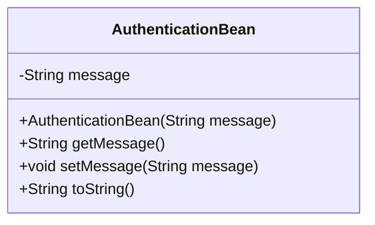
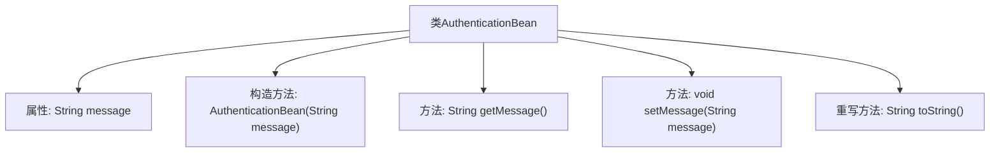

# 基础信息

|      |      |
|------|------|
| 名称 | AuthenticationBean |
| 编码语言 | .java |
| 代码路径 | spring-boot-examples/spring-boot-react-examples/spring-boot-react-basic-auth-login-logout/backend-spring-boot-react-basic-auth-login-logout/src/main/java/com/in28minutes/fullstack/springboot/fullstack/basic/authentication/springbootfullstackbasicauthloginlogout/basic/auth/AuthenticationBean.java |
| 包名 | com.in28minutes.fullstack.springboot.fullstack.basic.authentication.springbootfullstackbasicauthloginlogout.basic.auth |
| 依赖项 | [] |
| 概述说明 | AuthenticationBean类含消息属性，包含构造、获取、设置及字符串表示方法。 |

# 说明

AuthenticationBean类是一个用于处理身份验证信息的类，包含一个消息属性。该类提供了构造方法用于初始化对象，以及获取和设置消息属性的方法。此外，还包含一个字符串表示方法，用于将对象内容转换为字符串形式，便于输出或调试。这些方法共同实现了对消息属性的全面管理和操作。

# 类列表 Class Summary

| 名称   | 类型  | 说明 |
|-------|------|-------------|
| AuthenticationBean | class | AuthenticationBean类包含消息属性及其构造、获取、设置和字符串表示方法。 |

## 类 AuthenticationBean

|      |      |
|------|------|
| 访问范围 | public |
| 类型 | class |
| 名称 | AuthenticationBean |
| 说明 | AuthenticationBean类包含消息属性及其构造、获取、设置和字符串表示方法。 |

### UML类图

这段代码定义了一个名为 `AuthenticationBean` 的类，该类包含一个私有的字符串类型成员变量 `message`。类中提供了构造方法 `AuthenticationBean` 用于初始化 `message`，以及 `getMessage` 和 `setMessage` 方法用于获取和设置 `message` 的值。此外，`toString` 方法被重写以返回一个格式化的字符串，包含 `message` 的值。这个类主要用于封装和操作与认证相关的消息。

### 内部方法调用关系图

这段代码定义了一个名为 `AuthenticationBean` 的类，包含一个私有属性 `message` 以及相关的构造方法、getter 和 setter 方法。`toString` 方法被重写以返回格式化后的字符串。流程图展示了类的基本结构及其方法之间的关系，帮助理解类的功能和使用方式。

### 字段列表 Field List

| 名称  | 类型  | 说明 |
|-------|-------|------|
| message | String | 定义了一个私有的字符串类型变量message。 |

### 方法列表 Method List

| 名称  | 类型  | 说明 |
|-------|-------|------|
| getMessage | String | 方法返回消息字符串。 |
| setMessage | void | 该方法用于设置消息内容。 |
| toString | String | 重写toString方法，返回格式化字符串"HelloWorldBean [message=值]"。 |

