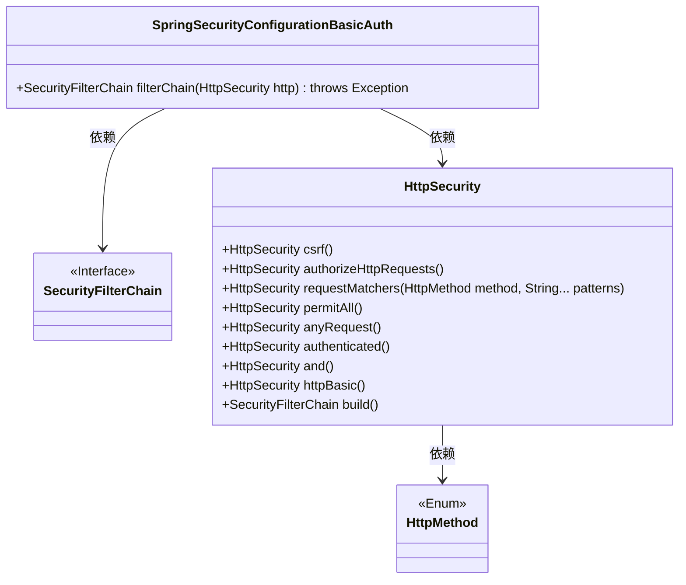
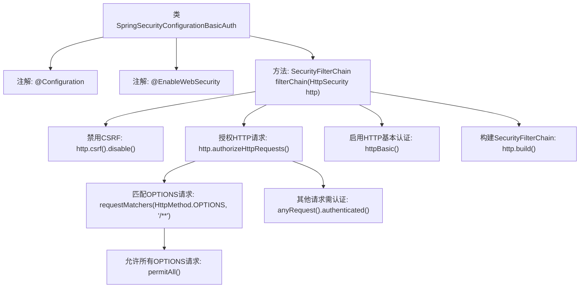

# 基础信息

|      |      |
|------|------|
| 名称 | SpringSecurityConfigurationBasicAuth |
| 编码语言 | .java |
| 代码路径 | spring-boot-examples/spring-boot-react-examples/spring-boot-react-basic-auth-login-logout/backend-spring-boot-react-basic-auth-login-logout/src/main/java/com/in28minutes/fullstack/springboot/fullstack/basic/authentication/springbootfullstackbasicauthloginlogout/basic/auth/SpringSecurityConfigurationBasicAuth.java |
| 包名 | com.in28minutes.fullstack.springboot.fullstack.basic.authentication.springbootfullstackbasicauthloginlogout.basic.auth |
| 依赖项 | ['org.springframework.context.annotation.Bean', 'org.springframework.context.annotation.Configuration', 'org.springframework.http.HttpMethod', 'org.springframework.security.config.annotation.web.builders.HttpSecurity', 'org.springframework.security.config.annotation.web.configuration.EnableWebSecurity', 'org.springframework.security.web.SecurityFilterChain'] |
| 概述说明 | Spring Security配置：禁用CSRF，允许OPTIONS请求，其他请求需HTTP基本认证。 |

# 说明

Spring Security配置中，禁用了CSRF保护功能，允许OPTIONS请求通过，其他所有请求需要进行身份认证。认证方式采用HTTP基本认证，确保只有经过验证的用户才能访问受保护的资源。

# 类列表 Class Summary

| 名称   | 类型  | 说明 |
|-------|------|-------------|
| SpringSecurityConfigurationBasicAuth | class | Spring Security配置，禁用CSRF，允许OPTIONS请求，其他请求需认证，使用HTTP基本认证。 |

## 类 SpringSecurityConfigurationBasicAuth

|      |      |
|------|------|
| 访问范围 | @Configuration;@EnableWebSecurity;public |
| 类型 | class |
| 名称 | SpringSecurityConfigurationBasicAuth |
| 说明 | Spring Security配置，禁用CSRF，允许OPTIONS请求，其他请求需认证，使用HTTP基本认证。 |

### UML类图

**描述：**  
`SpringSecurityConfigurationBasicAuth` 是一个配置类，用于配置Spring Security的基本认证。它通过 `filterChain` 方法定义了一个安全过滤器链，禁用了CSRF保护，允许所有OPTIONS请求，并要求所有其他请求进行基本认证。该类依赖于 `HttpSecurity` 和 `SecurityFilterChain` 接口来实现这些功能。

### 内部方法调用关系图

这段代码定义了一个Spring Security配置类，用于配置基本认证和请求授权。首先，禁用了CSRF保护，然后配置了HTTP请求的授权规则，允许所有OPTIONS请求，其他请求需要进行认证。最后，启用了HTTP基本认证，并构建了SecurityFilterChain。该配置类通过注解启用了Web安全功能，并返回了一个配置好的安全过滤器链。

### 字段列表 Field List

| 名称  | 类型  | 说明 |
|-------|-------|------|

### 方法列表 Method List

| 名称  | 类型  | 说明 |
|-------|-------|------|
| filterChain | SecurityFilterChain | 配置安全过滤器链，禁用CSRF，允许OPTIONS请求，其他请求需认证，启用HTTP基本认证。 |

