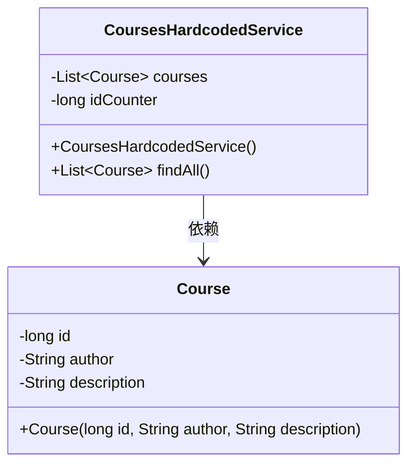
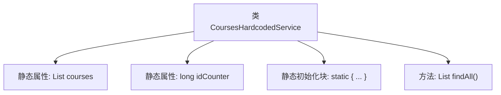

# 基础信息

|      |      |
|------|------|
| 名称 | CoursesHardcodedService |
| 编码语言 | .java |
| 代码路径 | spring-boot-examples/spring-boot-react-examples/spring-boot-react-basic-auth-login-logout/backend-spring-boot-react-basic-auth-login-logout/src/main/java/com/in28minutes/fullstack/springboot/fullstack/basic/authentication/springbootfullstackbasicauthloginlogout/course/CoursesHardcodedService.java |
| 包名 | com.in28minutes.fullstack.springboot.fullstack.basic.authentication.springbootfullstackbasicauthloginlogout.course |
| 依赖项 | ['java.util.ArrayList', 'java.util.List', 'org.springframework.stereotype.Service'] |
| 概述说明 | CoursesHardcodedService类提供Spring Boot、Angular、React、微服务及云部署课程。 |

# 说明

CoursesHardcodedService类是一个提供静态课程列表的服务类，其列表中包含与Spring Boot、Angular、React、微服务以及云部署相关的课程。该类的主要功能是为应用程序提供预定义的课程数据，方便用户访问和学习这些技术相关的课程内容。

# 类列表 Class Summary

| 名称   | 类型  | 说明 |
|-------|------|-------------|
| CoursesHardcodedService | class | CoursesHardcodedService类提供静态课程列表，包含Spring Boot和Angular、React、微服务及云部署相关课程。 |

## 类 CoursesHardcodedService

|      |      |
|------|------|
| 访问范围 | @Service;public |
| 类型 | class |
| 名称 | CoursesHardcodedService |
| 说明 | CoursesHardcodedService类提供静态课程列表，包含Spring Boot和Angular、React、微服务及云部署相关课程。 |

### UML类图

这段代码定义了一个名为 `CoursesHardcodedService` 的服务类，该类包含一个静态的 `Course` 对象列表 `courses` 和一个静态的 `idCounter` 计数器。在静态初始化块中，`courses` 列表被预填充了四个 `Course` 对象。`CoursesHardcodedService` 类提供了一个 `findAll()` 方法，用于返回 `courses` 列表。`Course` 类包含 `id`、`author` 和 `description` 三个私有属性，并通过构造函数进行初始化。`CoursesHardcodedService` 类依赖于 `Course` 类来存储课程信息。

### 内部方法调用关系图

这段代码定义了一个名为 `CoursesHardcodedService` 的服务类，其中包含一个静态的课程列表 `courses` 和一个静态的计数器 `idCounter`。在静态初始化块中，程序向 `courses` 列表中添加了四个预定义的课程对象，每个课程对象都有一个唯一的 `id` 和描述信息。类中的 `findAll` 方法用于返回整个课程列表。这段代码的主要作用是提供一个硬编码的课程数据源，供其他部分调用和查询。

### 字段列表 Field List

| 名称  | 类型  | 说明 |
|-------|-------|------|
| courses = new ArrayList<>() | List<Course> | 定义静态不可变课程列表变量。 |
| idCounter = 0 | long | 定义静态长整型变量idCounter，初始值为0。 |

### 方法列表 Method List

| 名称  | 类型  | 说明 |
|-------|-------|------|
| findAll | List<Course> | 该方法返回所有课程的列表。 |

