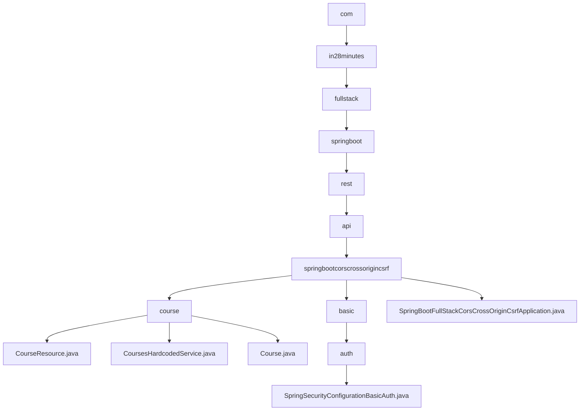

# 基础信息

|      |      |
|------|------|
| 名称 | com |
| 编码语言 | .java |
| 代码路径 | spring-boot-examples/spring-boot-react-examples/spring-boot-react-cors-cross-origin-csrf/backend-spring-boot-react-cors-cross-origin-csrf/src/main/java/com |
| 包名 | spring-boot-examples.spring-boot-react-examples.spring-boot-react-cors-cross-origin-csrf.backend-spring-boot-react-cors-cross-origin-csrf.src.main.java.com |
| 概述说明 | Spring Boot与React全栈示例，实现CORS和CSRF保护，支持跨域数据获取和课程列表管理。 |

# 说明

## 概述

该代码模块是一个基于Spring Boot和React的全栈示例，主要实现了跨域资源共享（CORS）和跨站请求伪造（CSRF）保护功能。模块的核心功能是允许跨域访问，并获取指定用户名下的所有课程列表。通过该模块，系统能够在不同域之间无缝获取相关课程信息，提高了系统的灵活性和用户体验。

## 主要业务场景

1. **跨域数据获取**：该模块通过实现CORS，允许前端应用从不同的域请求后端数据。这在现代Web应用中非常常见，尤其是当前端和后端部署在不同的服务器或域时。通过CORS配置，系统能够安全地处理跨域请求，确保用户能够无缝获取课程信息。

2. **课程列表管理**：模块中包含一个硬编码的课程列表，该列表涵盖了多个热门技术领域的课程，如Spring Boot、Angular、React、微服务以及云部署等。这些课程内容广泛，适合开发者学习和掌握现代软件开发中的关键技术。课程列表通过`CoursesHardcodedService`类提供，便于前端应用获取和展示。

3. **课程信息实体**：`Course`类用于表示课程的基本信息，包括课程ID、名称、描述等。该实体类与前端应用进行数据交互，确保课程信息的完整性和一致性。

4. **Spring Security配置**：在Spring Security配置类中，禁用了CSRF保护功能，允许OPTIONS请求通过，无需认证。对于其他所有请求，系统要求进行身份验证，并采用HTTP Basic认证方式确保安全性。该配置确保了特定请求的灵活性，同时维护了其他请求的安全验证机制。

通过上述功能，该模块为开发者提供了一个完整的全栈示例，展示了如何在现代Web应用中处理跨域请求、管理课程列表以及保护系统免受CSRF攻击。

### 包内部结构视图

该流程图展示了Spring Boot项目中Java类的层级关系，从根目录`com`开始，逐步深入到具体的包和类文件。每个节点代表路径的最后一级元素，清晰地展示了项目结构的层次关系，包括`course`包中的类文件和`basic`包中的安全配置类。

# 文件列表 File List

| 名称   | 类型  | 说明 |
|-------|------|-------------|
| [in28minutes](in28minutes/_module.md) | package | Spring Boot与React全栈示例，实现CORS和CSRF保护，支持跨域数据获取和课程列表管理。 |

