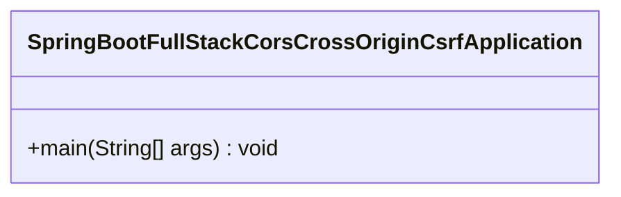
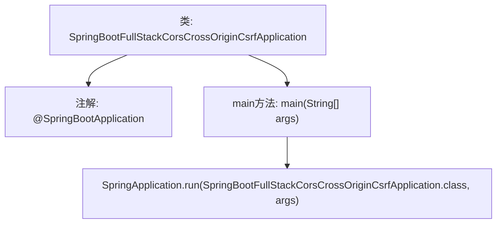

# 基础信息

|      |      |
|------|------|
| 名称 | SpringBootFullStackCorsCrossOriginCsrfApplication |
| 编码语言 | .java |
| 代码路径 | spring-boot-examples/spring-boot-react-examples/spring-boot-react-cors-cross-origin-csrf/backend-spring-boot-react-cors-cross-origin-csrf/src/main/java/com/in28minutes/fullstack/springboot/rest/api/springbootcorscrossorigincsrf/SpringBootFullStackCorsCrossOriginCsrfApplication.java |
| 包名 | com.in28minutes.fullstack.springboot.rest.api.springbootcorscrossorigincsrf |
| 依赖项 | ['org.springframework.boot.SpringApplication', 'org.springframework.boot.autoconfigure.SpringBootApplication'] |
| 概述说明 | Spring Boot启动类，含主方法和跨域配置。 |

# 说明

Spring Boot应用的启动类包含主方法和跨域配置。主方法是应用的入口点，负责启动整个Spring Boot应用程序。跨域配置则用于处理前端与后端之间的跨域请求，确保不同源之间的数据交互能够顺利进行。通过配置跨域规则，可以允许或限制特定的请求来源、方法和头信息，从而增强应用的安全性和灵活性。启动类通常还包含其他必要的配置和初始化操作，以确保应用能够正确运行并响应请求。

# 类列表 Class Summary

| 名称   | 类型  | 说明 |
|-------|------|-------------|
| SpringBootFullStackCorsCrossOriginCsrfApplication | class | Spring Boot应用启动类，包含主方法和跨域配置。 |

## 类 SpringBootFullStackCorsCrossOriginCsrfApplication

|      |      |
|------|------|
| 访问范围 | @SpringBootApplication;public |
| 类型 | class |
| 名称 | SpringBootFullStackCorsCrossOriginCsrfApplication |
| 说明 | Spring Boot应用启动类，包含主方法和跨域配置。 |

### UML类图

这段代码定义了一个名为 `SpringBootFullStackCorsCrossOriginCsrfApplication` 的类，该类使用 `@SpringBootApplication` 注解标记，表明它是一个 Spring Boot 应用程序的入口类。类中包含一个 `main` 方法，该方法通过调用 `SpringApplication.run` 来启动 Spring Boot 应用程序。`SpringApplication.run` 方法接受当前类的 `Class` 对象和命令行参数 `args` 作为参数，启动应用程序并初始化 Spring 上下文。

### 内部方法调用关系图

这段代码定义了一个Spring Boot应用程序的主类`SpringBootFullStackCorsCrossOriginCsrfApplication`，并使用`@SpringBootApplication`注解标记该类为Spring Boot应用的入口。`main`方法中调用`SpringApplication.run`来启动Spring Boot应用，传入当前类对象和命令行参数。这段代码的主要作用是初始化并启动一个Spring Boot应用程序，处理CORS、跨域和CSRF等安全配置。

### 字段列表 Field List

| 名称  | 类型  | 说明 |
|-------|-------|------|

### 方法列表 Method List

| 名称  | 类型  | 说明 |
|-------|-------|------|
| main | void | Spring Boot应用启动类，运行主程序并加载配置。 |

