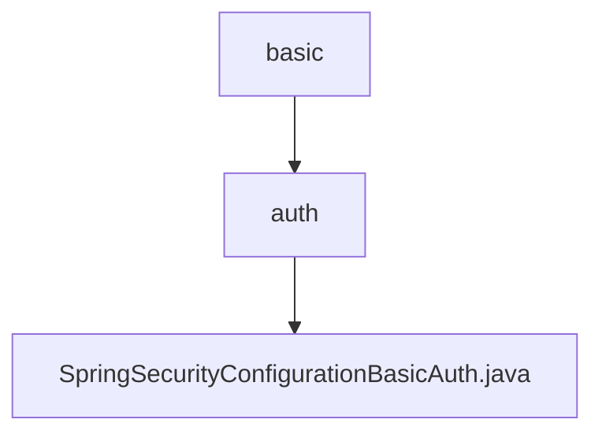

# 基础信息

|      |      |
|------|------|
| 名称 | basic |
| 编码语言 | .java |
| 代码路径 | spring-boot-examples/spring-boot-react-examples/spring-boot-react-cors-cross-origin-csrf/backend-spring-boot-react-cors-cross-origin-csrf/src/main/java/com/in28minutes/fullstack/springboot/rest/api/springbootcorscrossorigincsrf/basic |
| 包名 | spring-boot-examples.spring-boot-react-examples.spring-boot-react-cors-cross-origin-csrf.backend-spring-boot-react-cors-cross-origin-csrf.src.main.java.com.in28minutes.fullstack.springboot.rest.api.springbootcorscrossorigincsrf.basic |
| 概述说明 | Spring Security配置：禁用CSRF，允许OPTIONS，其他请求需HTTP Basic认证。 |

# 说明

Spring Security配置类中，禁用了CSRF保护功能，允许OPTIONS请求通过，无需认证。对于其他所有请求，系统要求进行身份验证，并采用HTTP Basic认证方式确保安全性。该配置确保了特定请求的灵活性，同时维护了其他请求的安全验证机制。

### 包内部结构视图

该流程图展示了Spring Boot项目中关于CORS和CSRF配置的层级关系。`basic`是根目录，包含`auth`子目录，而`auth`目录中又包含`SpringSecurityConfigurationBasicAuth.java`文件，用于配置Spring Security的基本认证。

# 文件列表 File List

| 名称   | 类型  | 说明 |
|-------|------|-------------|
| [auth](auth/_module.md) | package | Spring Security配置：禁用CSRF，允许OPTIONS，其他请求需HTTP Basic认证。 |

