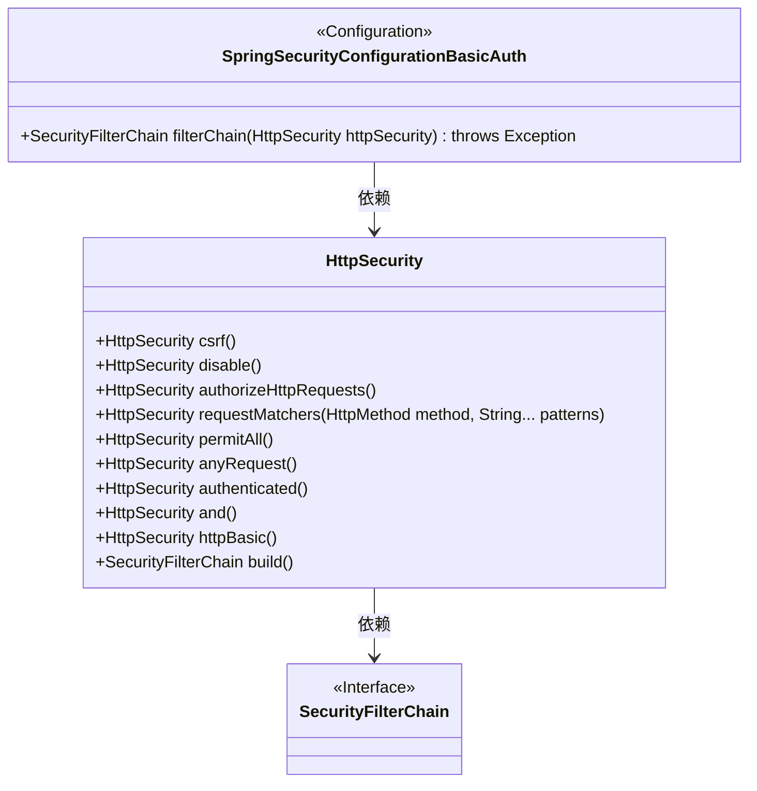
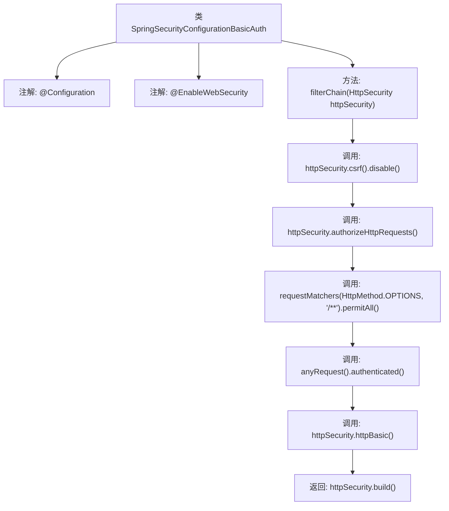

# 基础信息

|      |      |
|------|------|
| 名称 | SpringSecurityConfigurationBasicAuth |
| 编码语言 | .java |
| 代码路径 | spring-boot-examples/spring-boot-react-examples/spring-boot-react-cors-cross-origin-csrf/backend-spring-boot-react-cors-cross-origin-csrf/src/main/java/com/in28minutes/fullstack/springboot/rest/api/springbootcorscrossorigincsrf/basic/auth/SpringSecurityConfigurationBasicAuth.java |
| 包名 | com.in28minutes.fullstack.springboot.rest.api.springbootcorscrossorigincsrf.basic.auth |
| 依赖项 | ['org.springframework.context.annotation.Bean', 'org.springframework.context.annotation.Configuration', 'org.springframework.http.HttpMethod', 'org.springframework.security.config.annotation.web.builders.HttpSecurity', 'org.springframework.security.config.annotation.web.configuration.EnableWebSecurity', 'org.springframework.security.web.SecurityFilterChain'] |
| 概述说明 | Spring Security配置：禁用CSRF，允许OPTIONS，其他请求需HTTP Basic认证。 |

# 说明

Spring Security配置类中，禁用了CSRF保护功能，允许OPTIONS请求通过，无需认证。对于其他所有请求，系统要求进行身份验证，并采用HTTP Basic认证方式确保安全性。该配置确保了特定请求的灵活性，同时维护了其他请求的安全验证机制。

# 类列表 Class Summary

| 名称   | 类型  | 说明 |
|-------|------|-------------|
| SpringSecurityConfigurationBasicAuth | class | Spring Security配置类，禁用CSRF，允许OPTIONS请求，其他请求需认证并使用HTTP Basic认证。 |

## 类 SpringSecurityConfigurationBasicAuth

|      |      |
|------|------|
| 访问范围 | @Configuration;@EnableWebSecurity;public |
| 类型 | class |
| 名称 | SpringSecurityConfigurationBasicAuth |
| 说明 | Spring Security配置类，禁用CSRF，允许OPTIONS请求，其他请求需认证并使用HTTP Basic认证。 |

### UML类图

**描述：**
`SpringSecurityConfigurationBasicAuth` 是一个配置类，用于启用Spring Security的基本认证功能。它通过`filterChain`方法配置了HTTP请求的安全性，禁用了CSRF保护，允许所有OPTIONS请求，并要求其他所有请求都必须经过认证。`HttpSecurity`类提供了链式调用的方法来配置安全性，最终返回一个`SecurityFilterChain`实例。

### 内部方法调用关系图

这段代码定义了一个Spring Security配置类`SpringSecurityConfigurationBasicAuth`，用于配置HTTP请求的安全策略。代码通过禁用CSRF保护、允许所有OPTIONS请求、并要求其他所有请求进行身份验证，最后启用HTTP基本认证。流程图展示了从类定义到方法调用的完整流程，清晰地反映了安全配置的步骤。

### 字段列表 Field List

| 名称  | 类型  | 说明 |
|-------|-------|------|

### 方法列表 Method List

| 名称  | 类型  | 说明 |
|-------|-------|------|
| filterChain | SecurityFilterChain | 配置安全过滤器链，禁用CSRF，允许OPTIONS请求，其他请求需认证。 |

