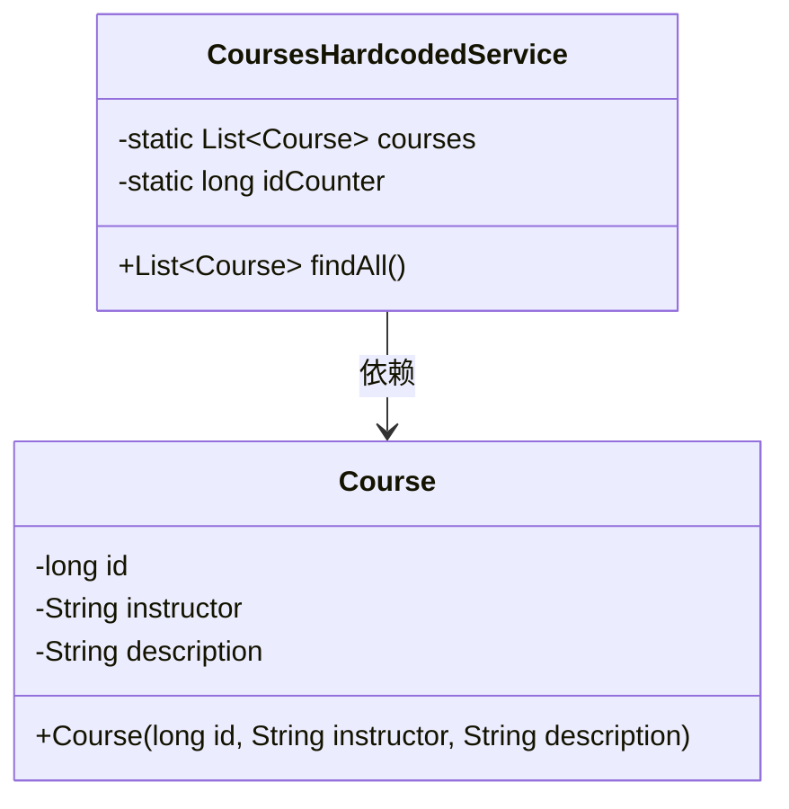
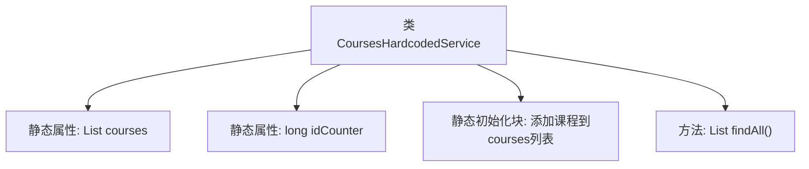

# 基础信息

|      |      |
|------|------|
| 名称 | CoursesHardcodedService |
| 编码语言 | .java |
| 代码路径 | spring-boot-examples/spring-boot-react-examples/spring-boot-react-cors-cross-origin-csrf/backend-spring-boot-react-cors-cross-origin-csrf/src/main/java/com/in28minutes/fullstack/springboot/rest/api/springbootcorscrossorigincsrf/course/CoursesHardcodedService.java |
| 包名 | com.in28minutes.fullstack.springboot.rest.api.springbootcorscrossorigincsrf.course |
| 依赖项 | ['java.util.ArrayList', 'java.util.List', 'org.springframework.stereotype.Service'] |
| 概述说明 | CoursesHardcodedService类提供Spring Boot、Angular、React、微服务及云部署课程列表。 |

# 说明

CoursesHardcodedService类用于提供硬编码的课程列表，该列表包含多个热门技术领域的课程，具体涵盖Spring Boot、Angular、React、微服务以及云部署等相关课程。这些课程内容广泛，适合开发者学习和掌握现代软件开发中的关键技术。

# 类列表 Class Summary

| 名称   | 类型  | 说明 |
|-------|------|-------------|
| CoursesHardcodedService | class | CoursesHardcodedService类提供硬编码课程列表，包含Spring Boot、Angular、React、微服务及云部署相关课程。 |

## 类 CoursesHardcodedService

|      |      |
|------|------|
| 访问范围 | @Service;public |
| 类型 | class |
| 名称 | CoursesHardcodedService |
| 说明 | CoursesHardcodedService类提供硬编码课程列表，包含Spring Boot、Angular、React、微服务及云部署相关课程。 |

### UML类图

类图描述：
`CoursesHardcodedService` 类是一个服务类，包含一个静态的 `Course` 对象列表和一个静态的 `idCounter` 计数器。该类提供了一个 `findAll` 方法，用于返回所有课程列表。`Course` 类表示课程对象，包含 `id`、`instructor` 和 `description` 三个私有属性，并通过构造函数进行初始化。`CoursesHardcodedService` 类依赖于 `Course` 类来存储和管理课程数据。

### 内部方法调用关系图

这段代码定义了一个名为 `CoursesHardcodedService` 的类，该类包含一个静态的 `courses` 列表和一个静态的 `idCounter` 计数器。在静态初始化块中，程序向 `courses` 列表中添加了四个 `Course` 对象，每个对象都有一个递增的 ID 和相关的课程信息。类中还定义了一个 `findAll` 方法，用于返回 `courses` 列表。这段代码的主要作用是初始化课程数据并提供获取所有课程的方法。

### 字段列表 Field List

| 名称  | 类型  | 说明 |
|-------|-------|------|
| courses = new ArrayList<>() | List<Course> | 定义一个私有的静态最终课程列表。 |
| idCounter = 0 | long | 静态长整型变量idCounter初始化为0。 |

### 方法列表 Method List

| 名称  | 类型  | 说明 |
|-------|-------|------|
| findAll | List<Course> | 该方法返回所有课程列表。 |

