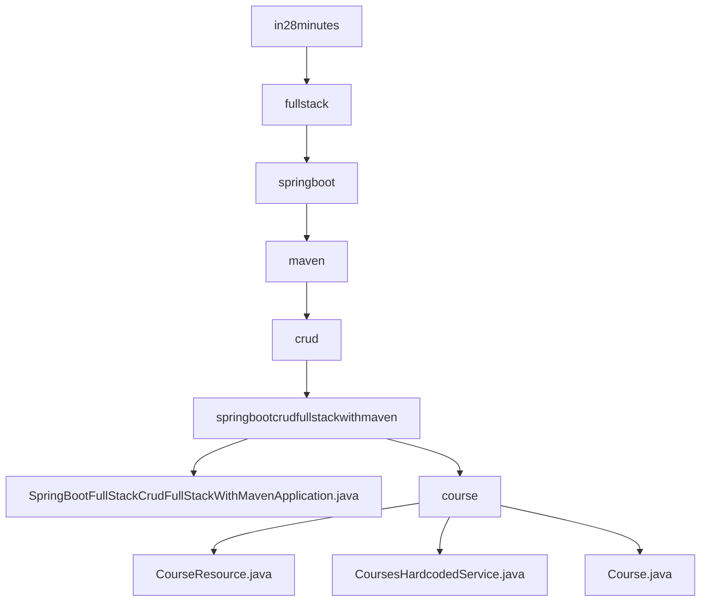

# 基础信息

|      |      |
|------|------|
| 名称 | in28minutes |
| 编码语言 | .java |
| 代码路径 | spring-boot-examples/spring-boot-react-examples/spring-boot-react-crud-full-stack-with-maven/backend-spring-boot-react-crud-full-stack-with-maven/src/main/java/com/in28minutes |
| 包名 | spring-boot-examples.spring-boot-react-examples.spring-boot-react-crud-full-stack-with-maven.backend-spring-boot-react-crud-full-stack-with-maven.src.main.java.com.in28minutes |
| 概述说明 | Spring Boot应用通过Maven构建，实现CRUD功能，简化开发流程，支持课程管理API。 |

# 说明

## 概述
该代码模块是一个基于Spring Boot的课程管理API，旨在简化课程数据的管理流程。模块通过提供对课程数据的增删改查（CRUD）操作，使用户能够方便地管理课程信息。该应用利用Spring Boot框架的便捷性，简化了开发流程，并通过Maven进行项目构建，确保了高效的项目管理和依赖控制。模块的核心功能包括课程信息的查询、创建、更新和删除，整体设计符合现代Web应用的标准，具备良好的扩展性和维护性。

## 主要业务场景
该模块适用于以下业务场景：

1. **课程信息查询**：用户可以通过API查询现有课程的信息，获取课程的详细信息。
2. **课程创建**：用户可以通过API创建新的课程，提交课程的相关信息（如`id`、`username`和`description`）。
3. **课程更新**：用户可以通过API更新现有课程的内容，修改课程的描述或其他属性。
4. **课程删除**：用户可以通过API删除不再需要的课程，确保课程数据的及时清理。

该模块的设计使得课程管理操作更加高效和便捷，适用于需要频繁管理课程数据的应用场景。

### 包内部结构视图

该流程图展示了一个Spring Boot项目的层级结构，从根目录`in28minutes`逐步深入到具体的Java文件和文件夹。`springbootcrudfullstackwithmaven`是核心模块，包含主应用程序类和课程相关的资源文件。每个节点代表路径的最后一级元素，清晰地展示了文件与文件夹之间的嵌套关系。

# 文件列表 File List

| 名称   | 类型  | 说明 |
|-------|------|-------------|
| [fullstack](fullstack/_module.md) | package | Spring Boot应用通过Maven构建，实现CRUD功能，简化开发流程，支持课程管理API。 |

