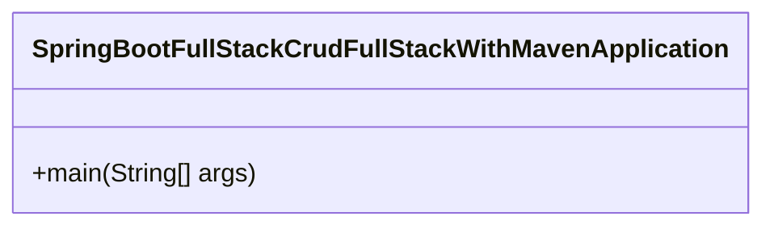
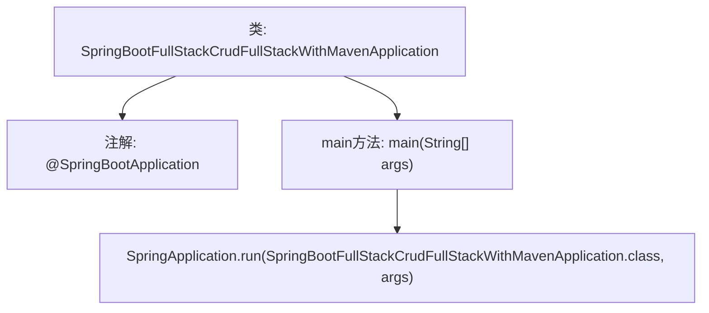

# 基础信息

|      |      |
|------|------|
| 名称 | SpringBootFullStackCrudFullStackWithMavenApplication |
| 编码语言 | .java |
| 代码路径 | spring-boot-examples/spring-boot-react-examples/spring-boot-react-crud-full-stack-with-maven/backend-spring-boot-react-crud-full-stack-with-maven/src/main/java/com/in28minutes/fullstack/springboot/maven/crud/springbootcrudfullstackwithmaven/SpringBootFullStackCrudFullStackWithMavenApplication.java |
| 包名 | com.in28minutes.fullstack.springboot.maven.crud.springbootcrudfullstackwithmaven |
| 依赖项 | ['org.springframework.boot.SpringApplication', 'org.springframework.boot.autoconfigure.SpringBootApplication'] |
| 概述说明 | Spring Boot应用主类，Maven构建，支持CRUD功能。 |

# 说明

Spring Boot应用的主类通过Maven进行构建，主要实现了CRUD（创建、读取、更新、删除）功能。该应用利用Spring Boot框架的便捷性，简化了开发流程，确保了高效的项目管理和依赖控制。通过Maven的构建工具，项目能够轻松管理依赖包和构建过程，使得开发、测试和部署更加流畅。CRUD功能的实现涵盖了数据的增删改查操作，确保了应用的核心数据处理能力。整体设计符合现代Web应用的标准，具备良好的扩展性和维护性。

# 类列表 Class Summary

| 名称   | 类型  | 说明 |
|-------|------|-------------|
| SpringBootFullStackCrudFullStackWithMavenApplication | class | Spring Boot应用主类，使用Maven构建，实现CRUD功能。 |

## 类 SpringBootFullStackCrudFullStackWithMavenApplication

|      |      |
|------|------|
| 访问范围 | @SpringBootApplication;public |
| 类型 | class |
| 名称 | SpringBootFullStackCrudFullStackWithMavenApplication |
| 说明 | Spring Boot应用主类，使用Maven构建，实现CRUD功能。 |

### UML类图

这段代码定义了一个名为 `SpringBootFullStackCrudFullStackWithMavenApplication` 的类，该类是 Spring Boot 应用的入口点。通过 `@SpringBootApplication` 注解，该类被标记为 Spring Boot 应用的主类。`main` 方法是应用的启动入口，调用 `SpringApplication.run` 方法来启动 Spring Boot 应用。该代码的主要作用是初始化并运行一个 Spring Boot 应用，通常用于构建全栈 CRUD 应用。

### 内部方法调用关系图

这段代码是一个Spring Boot应用程序的入口类，使用了`@SpringBootApplication`注解来标记这是一个Spring Boot应用。`main`方法是程序的起点，通过调用`SpringApplication.run`方法来启动Spring Boot应用。流程图展示了类的结构、注解的使用以及`main`方法中启动Spring Boot应用的关键步骤。

### 字段列表 Field List

| 名称  | 类型  | 说明 |
|-------|-------|------|

### 方法列表 Method List

| 名称  | 类型  | 说明 |
|-------|-------|------|
| main | void | Spring Boot应用启动主方法，运行Maven构建的全栈CRUD应用。 |

