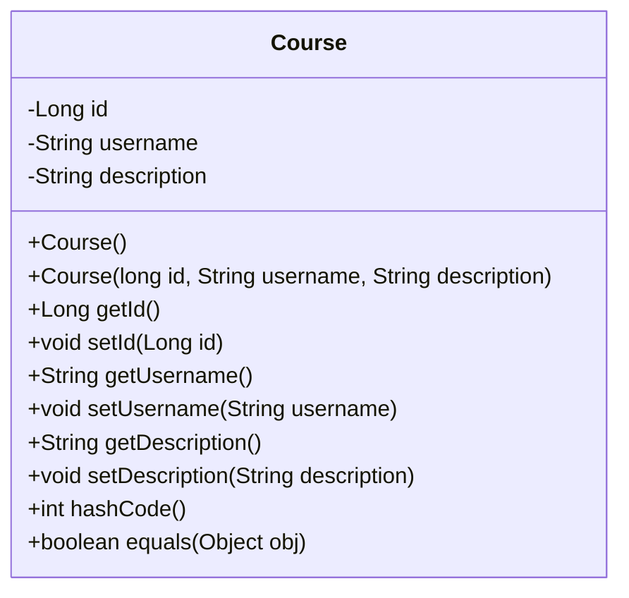

# 基础信息

|      |      |
|------|------|
| 名称 | Course |
| 编码语言 | .java |
| 代码路径 | spring-boot-examples/spring-boot-react-examples/spring-boot-react-crud-full-stack-with-maven/backend-spring-boot-react-crud-full-stack-with-maven/src/main/java/com/in28minutes/fullstack/springboot/maven/crud/springbootcrudfullstackwithmaven/course/Course.java |
| 包名 | com.in28minutes.fullstack.springboot.maven.crud.springbootcrudfullstackwithmaven.course |
| 依赖项 | [] |
| 概述说明 | Course类含id、username、description属性，提供构造、getter/setter，重写hashCode、equals。 |

# 说明

Course类包含三个属性：id、username和description。该类提供了构造方法用于初始化这些属性，并提供了getter和setter方法用于访问和修改这些属性。此外，该类还重写了hashCode和equals方法，以确保对象在哈希集合中的唯一性和比较时的准确性。这些方法的重写有助于在集合操作中正确识别和处理Course对象。

# 类列表 Class Summary

| 名称   | 类型  | 说明 |
|-------|------|-------------|
| Course | class | Course类包含id、username和description属性，提供构造方法和getter/setter，重写hashCode和equals方法。 |

## 类 Course

|      |      |
|------|------|
| 访问范围 | public |
| 类型 | class |
| 名称 | Course |
| 说明 | Course类包含id、username和description属性，提供构造方法和getter/setter，重写hashCode和equals方法。 |

### UML类图

这段代码定义了一个名为 `Course` 的类，该类包含三个私有属性：`id`、`username` 和 `description`。类中提供了无参构造函数和带参构造函数，以及对应的 getter 和 setter 方法。此外，类中还重写了 `hashCode` 和 `equals` 方法，用于比较两个 `Course` 对象的相等性。`hashCode` 方法通过将属性的哈希值组合计算出一个唯一的哈希码，而 `equals` 方法则通过逐一比较对象的属性值来判断它们是否相等。

### 内部方法调用关系图

```mermaid
graph TD
    A["类Course"]
    B["属性: Long id"]
    C["属性: String username"]
    D["属性: String description"]
    E["无参构造方法: Course()"]
    F["有参构造方法: Course(long id, String username, String description)"]
    G["方法: Long getId()"]
    H["方法: void setId(Long id)"]
    I["方法: String getUsername()"]
    J["方法: void setUsername(String username)"]
    K["方法: String getDescription()"]
    L["方法: void setDescription(String description)"]
    M["重写方法: int hashCode()"]
    N["重写方法: boolean equals(Object obj)"]

    A --> B
    A --> C
    A --> D
    A --> E
    A --> F
    A --> G
    A --> H
    A --> I
    A --> J
    A --> K
    A --> L
    A --> M
    A --> N
```

这段代码定义了一个名为 `Course` 的类，包含三个私有属性：`id`、`username` 和 `description`。类中提供了无参和有参构造方法，以及各个属性的 `getter` 和 `setter` 方法。此外，类还重写了 `hashCode` 和 `equals` 方法，用于对象的哈希值计算和相等性比较。流程图清晰地展示了类的结构及其内部方法的调用关系。

### 字段列表 Field List

| 名称  | 类型  | 说明 |
|-------|-------|------|
| id | Long | 定义一个长整型私有变量id。 |
| username | String | 定义了一个私有的字符串类型变量username。 |
| description | String | 私有字符串变量，用于存储描述信息。 |

### 方法列表 Method List

| 名称  | 类型  | 说明 |
|-------|-------|------|
| getId | Long | 获取ID值的方法。 |
| getUsername | String | 该方法返回用户名字符串。 |
| getDescription | String | 该方法返回字符串类型的描述信息。 |
| setId | void | 设置对象ID的方法。 |
| setDescription | void | 设置描述属性的方法。 |
| hashCode | int | 重写hashCode方法，计算包含description、id、username的哈希值。 |
| equals | boolean | 重写equals方法，比较对象类、描述、ID和用户名是否相等。 |
| setUsername | void | 设置用户名的Java方法，将传入值赋给类变量。 |

