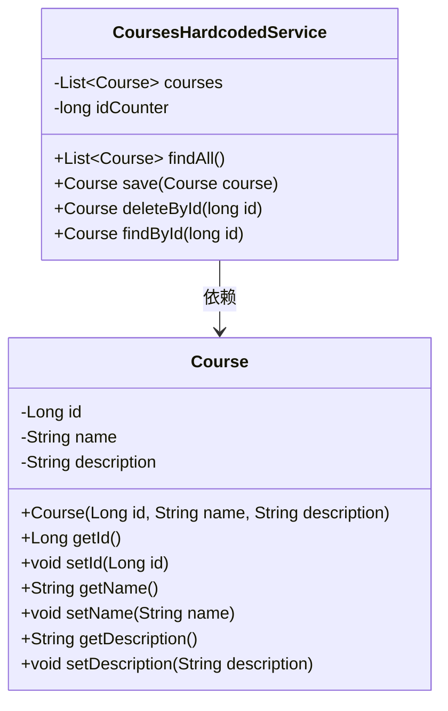
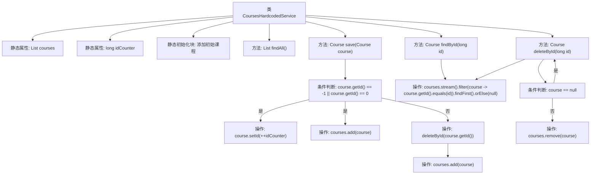

# 基础信息

|      |      |
|------|------|
| 名称 | CoursesHardcodedService |
| 编码语言 | .java |
| 代码路径 | spring-boot-examples/spring-boot-react-examples/spring-boot-react-crud-full-stack-with-maven/backend-spring-boot-react-crud-full-stack-with-maven/src/main/java/com/in28minutes/fullstack/springboot/maven/crud/springbootcrudfullstackwithmaven/course/CoursesHardcodedService.java |
| 包名 | com.in28minutes.fullstack.springboot.maven.crud.springbootcrudfullstackwithmaven.course |
| 依赖项 | ['java.util.ArrayList', 'java.util.List', 'org.springframework.stereotype.Service'] |
| 概述说明 | 硬编码课程服务类实现课程增删查功能，使用静态列表存储数据。 |

# 说明

硬编码课程服务类是一个专门用于管理课程数据的服务类，提供了课程的增加、删除和查询功能。该类使用静态列表作为存储结构来保存课程数据，确保数据在程序运行期间保持一致性和可访问性。通过该服务类，用户可以方便地对课程进行管理操作，包括添加新课程、删除现有课程以及查询课程信息。这种设计简化了课程数据的管理流程，提高了操作的效率和便捷性。

# 类列表 Class Summary

| 名称   | 类型  | 说明 |
|-------|------|-------------|
| CoursesHardcodedService | class | 硬编码课程服务类，提供课程增删查功能，使用静态列表存储课程数据。 |

## 类 CoursesHardcodedService

|      |      |
|------|------|
| 访问范围 | @Service;public |
| 类型 | class |
| 名称 | CoursesHardcodedService |
| 说明 | 硬编码课程服务类，提供课程增删查功能，使用静态列表存储课程数据。 |

### UML类图

### 描述：
`CoursesHardcodedService` 类负责管理课程列表，提供了查找、保存、删除和按ID查找课程的功能。课程信息存储在 `Course` 类中，该类包含课程ID、名称和描述等属性。`CoursesHardcodedService` 通过静态初始化块初始化了一些默认课程，并通过 `idCounter` 来生成唯一的课程ID。该类的方法包括 `findAll` 获取所有课程，`save` 保存或更新课程，`deleteById` 删除指定ID的课程，以及 `findById` 按ID查找课程。

### 内部方法调用关系图

这段代码定义了一个名为 `CoursesHardcodedService` 的类，用于管理课程数据。类中包含一个静态初始化的课程列表和一个计数器 `idCounter`。`findAll` 方法返回所有课程，`save` 方法用于保存或更新课程，`deleteById` 方法用于删除指定课程，`findById` 方法用于查找指定课程。代码通过流操作和条件判断来处理课程的增加、删除和查找。

### 字段列表 Field List

| 名称  | 类型  | 说明 |
|-------|-------|------|
| courses = new ArrayList<>() | List<Course> | 定义一个静态不可变的课程列表变量。 |
| idCounter = 0 | long | 定义静态长整型变量idCounter并初始化为0。 |

### 方法列表 Method List

| 名称  | 类型  | 说明 |
|-------|-------|------|
| findAll | List<Course> | 该方法返回课程列表中的所有课程。 |
| deleteById | Course | 根据ID删除课程，若存在则移除并返回该课程，否则返回空。 |
| save | Course | 保存课程，若ID为-1或0则生成新ID并添加，否则删除旧记录后添加。 |
| findById | Course | 通过ID查找课程，返回匹配的第一个或null。 |

