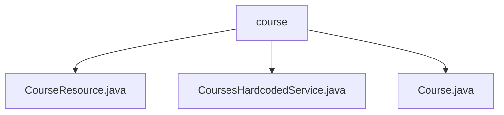

# 基础信息

|      |      |
|------|------|
| 名称 | course |
| 编码语言 | .java |
| 代码路径 | spring-boot-examples/spring-boot-react-examples/spring-boot-react-crud-full-stack-with-maven/backend-spring-boot-react-crud-full-stack-with-maven/src/main/java/com/in28minutes/fullstack/springboot/maven/crud/springbootcrudfullstackwithmaven/course |
| 包名 | spring-boot-examples.spring-boot-react-examples.spring-boot-react-crud-full-stack-with-maven.backend-spring-boot-react-crud-full-stack-with-maven.src.main.java.com.in28minutes.fullstack.springboot.maven.crud.springbootcrudfullstackwithmaven.course |
| 概述说明 | 课程管理API实现增删改查功能，简化课程数据操作流程。 |

# 说明

## 概述
该代码模块实现了一个课程管理API，旨在简化课程数据的管理流程。模块通过提供对课程数据的增删改查操作，使用户能够方便地管理课程信息。API的设计注重效率和准确性，确保数据操作的一致性和可访问性。模块包含以下几个核心组件：

1. **CourseResource.java**：实现了课程管理API，提供了查询、删除、更新和创建课程的功能。
2. **CoursesHardcodedService.java**：一个硬编码的课程服务类，使用静态列表存储课程数据，并提供增加、删除和查询功能。
3. **Course.java**：定义了课程类，包含`id`、`username`和`description`三个属性，并提供了构造方法、getter/setter方法，以及重写了`hashCode`和`equals`方法以确保对象的唯一性和比较准确性。

## 主要业务场景
该模块适用于以下业务场景：

1. **课程信息查询**：用户可以通过API查询现有课程的信息，获取课程的详细信息。
2. **课程创建**：用户可以通过API创建新的课程，提交课程的相关信息（如`id`、`username`和`description`）。
3. **课程更新**：用户可以通过API更新现有课程的内容，修改课程的描述或其他属性。
4. **课程删除**：用户可以通过API删除不再需要的课程，确保课程数据的及时清理。

该模块的设计使得课程管理操作更加高效和便捷，适用于需要频繁管理课程数据的应用场景。

### 包内部结构视图

该流程图展示了在`course`目录下的文件层级关系。`course`作为根节点，包含了三个子节点：`CourseResource.java`、`CoursesHardcodedService.java`和`Course.java`。这些文件共同构成了该目录的主要内容，反映了在该路径下的文件结构和依赖关系。

# 文件列表 File List

| 名称   | 类型  | 说明 |
|-------|------|-------------|
| [CoursesHardcodedService.java](CoursesHardcodedService.md) | file | 硬编码课程服务类实现课程增删查功能，使用静态列表存储数据。 |
| [Course.java](Course.md) | file | Course类含id、username、description属性，提供构造、getter/setter，重写hashCode、equals。 |
| [CourseResource.java](CourseResource.md) | file | 课程管理API支持查询、删除、更新和创建课程操作。 |

