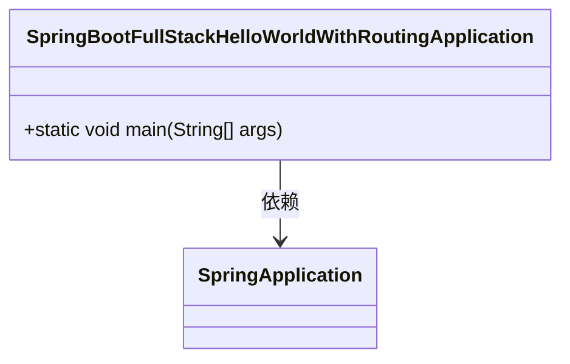
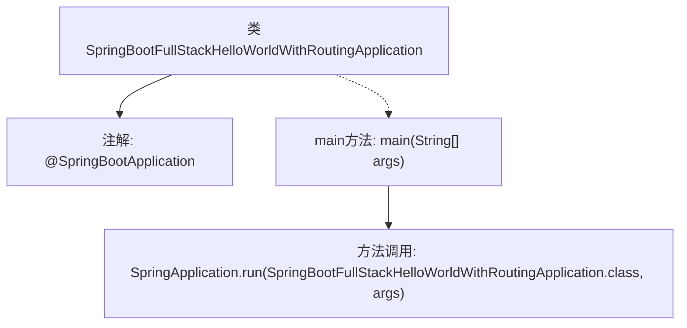

# 基础信息

|      |      |
|------|------|
| 名称 | SpringBootFullStackHelloWorldWithRoutingApplication |
| 编码语言 | .java |
| 代码路径 | spring-boot-examples/spring-boot-react-examples/spring-boot-react-hello-world-with-routing/backend-spring-boot-react-hello-world-with-routing/src/main/java/com/in28minutes/fullstack/springboot/helloworld/springboothelloworldwithrouting/SpringBootFullStackHelloWorldWithRoutingApplication.java |
| 包名 | com.in28minutes.fullstack.springboot.helloworld.springboothelloworldwithrouting |
| 依赖项 | ['org.springframework.boot.SpringApplication', 'org.springframework.boot.autoconfigure.SpringBootApplication'] |
| 概述说明 | Spring Boot启动类，包含主方法运行Hello World示例。 |

# 说明

Spring Boot应用启动类包含主方法，用于运行一个全栈Hello World路由示例。该启动类是应用的入口点，负责初始化并启动Spring Boot应用程序。通过主方法，应用程序能够加载必要的配置和依赖，并启动内嵌的Web服务器。启动类还定义了路由处理逻辑，确保当用户访问特定URL时，能够返回“Hello World”的响应。该示例展示了如何快速构建和运行一个简单的Spring Boot全栈应用。

# 类列表 Class Summary

| 名称   | 类型  | 说明 |
|-------|------|-------------|
| SpringBootFullStackHelloWorldWithRoutingApplication | class | Spring Boot应用启动类，包含主方法以运行全栈Hello World路由示例。 |

## 类 SpringBootFullStackHelloWorldWithRoutingApplication

|      |      |
|------|------|
| 访问范围 | @SpringBootApplication;public |
| 类型 | class |
| 名称 | SpringBootFullStackHelloWorldWithRoutingApplication |
| 说明 | Spring Boot应用启动类，包含主方法以运行全栈Hello World路由示例。 |

### UML类图

类图描述：`SpringBootFullStackHelloWorldWithRoutingApplication` 是一个Spring Boot应用程序的入口类，它包含一个静态的 `main` 方法，用于启动Spring Boot应用。该类依赖于 `SpringApplication` 类，通过调用 `SpringApplication.run` 方法来启动应用程序。这个类图展示了Spring Boot应用程序的基本结构和启动流程。

### 内部方法调用关系图

这段代码定义了一个Spring Boot应用程序的入口类 `SpringBootFullStackHelloWorldWithRoutingApplication`，并使用 `@SpringBootApplication` 注解标记该类为Spring Boot应用的启动类。`main` 方法是程序的入口点，它通过调用 `SpringApplication.run` 方法来启动Spring Boot应用，并将当前类及其参数传递给该方法。

### 字段列表 Field List

| 名称  | 类型  | 说明 |
|-------|-------|------|

### 方法列表 Method List

| 名称  | 类型  | 说明 |
|-------|-------|------|
| main | void | Spring Boot应用启动类，运行主程序并启动应用。 |

