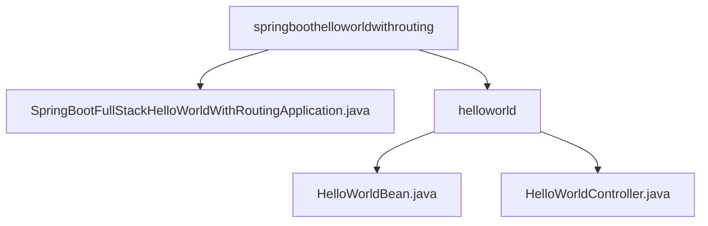

# 基础信息

|      |      |
|------|------|
| 名称 | springboothelloworldwithrouting |
| 编码语言 | .java |
| 代码路径 | spring-boot-examples/spring-boot-react-examples/spring-boot-react-hello-world-with-routing/backend-spring-boot-react-hello-world-with-routing/src/main/java/com/in28minutes/fullstack/springboot/helloworld/springboothelloworldwithrouting |
| 包名 | spring-boot-examples.spring-boot-react-examples.spring-boot-react-hello-world-with-routing.backend-spring-boot-react-hello-world-with-routing.src.main.java.com.in28minutes.fullstack.springboot.helloworld.springboothelloworldwithrouting |
| 概述说明 | Spring Boot启动类运行全栈Hello World路由示例，支持跨域请求和多格式数据返回。 |

# 说明

## 概述
该代码模块是一个基于Spring Boot和React的前后端分离示例项目，主要用于展示如何在Spring Boot后端应用中实现跨域请求支持，并提供多种格式的Hello World信息。该模块的核心功能是通过RESTful API返回不同格式的Hello World消息，确保前端应用（如React）能够跨域访问这些接口。Spring Boot应用启动类包含主方法，用于运行一个全栈Hello World路由示例。该启动类是应用的入口点，负责初始化并启动Spring Boot应用程序。通过主方法，应用程序能够加载必要的配置和依赖，并启动内嵌的Web服务器。启动类还定义了路由处理逻辑，确保当用户访问特定URL时，能够返回“Hello World”的响应。该示例展示了如何快速构建和运行一个简单的Spring Boot全栈应用。

## 主要业务场景
1. **跨域请求支持**：通过配置控制器类，确保前端应用在不同域名或端口下能够正常访问后端接口，增强了系统的兼容性和灵活性。
2. **多格式数据返回**：提供了多个GET接口，分别返回纯文本、JSON等不同格式的Hello World信息，以满足不同客户端的需求。
3. **前后端分离示例**：该模块作为Spring Boot与React集成的示例，展示了如何在前端应用中使用路由功能与后端进行交互，适用于学习和开发前后端分离的应用场景。

### 包内部结构视图

该流程图展示了Spring Boot React Hello World项目的后端代码结构。`springboothelloworldwithrouting`作为根目录，包含一个主应用程序文件`SpringBootFullStackHelloWorldWithRoutingApplication.java`和一个`helloworld`子目录。`helloworld`目录下包含两个文件：`HelloWorldBean.java`和`HelloWorldController.java`，分别用于定义Bean和处理控制器逻辑。

# 文件列表 File List

| 名称   | 类型  | 说明 |
|-------|------|-------------|
| [SpringBootFullStackHelloWorldWithRoutingApplication.java](SpringBootFullStackHelloWorldWithRoutingApplication.md) | file | Spring Boot启动类，包含主方法运行Hello World示例。 |
| [helloworld](helloworld/_module.md) | package | 控制器类支持跨域请求，提供三个GET接口返回不同格式的Hello World信息。 |

