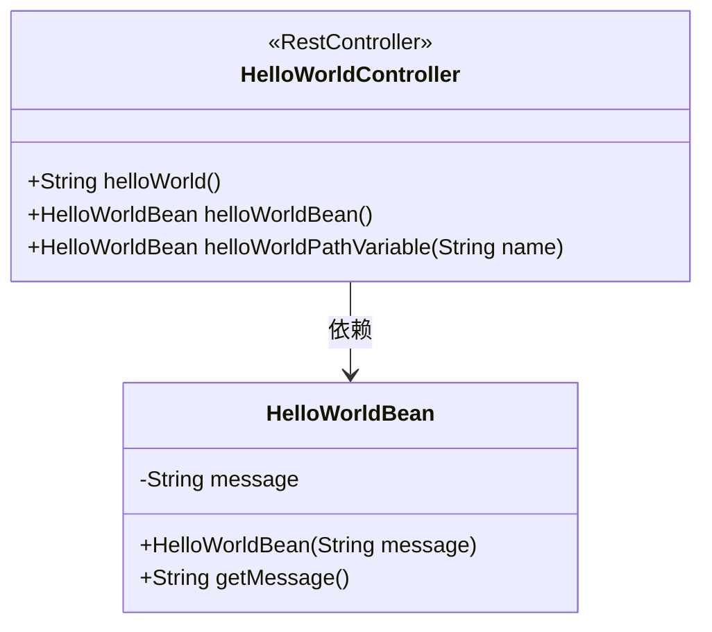
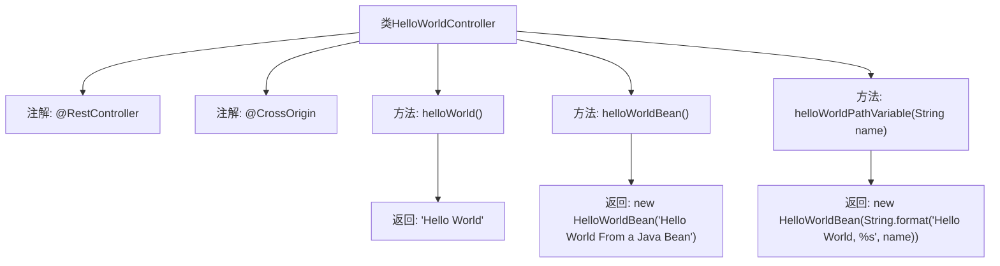

# 基础信息

|      |      |
|------|------|
| 名称 | HelloWorldController |
| 编码语言 | .java |
| 代码路径 | spring-boot-examples/spring-boot-react-examples/spring-boot-react-hello-world-with-routing/backend-spring-boot-react-hello-world-with-routing/src/main/java/com/in28minutes/fullstack/springboot/helloworld/springboothelloworldwithrouting/helloworld/HelloWorldController.java |
| 包名 | com.in28minutes.fullstack.springboot.helloworld.springboothelloworldwithrouting.helloworld |
| 依赖项 | ['org.springframework.web.bind.annotation.CrossOrigin', 'org.springframework.web.bind.annotation.GetMapping', 'org.springframework.web.bind.annotation.PathVariable', 'org.springframework.web.bind.annotation.RestController'] |
| 概述说明 | 控制器类支持跨域请求，提供三个GET接口返回不同格式的Hello World信息。 |

# 说明

控制器类支持跨域请求，提供了三个GET接口，分别返回不同格式的Hello World信息。这些接口能够处理跨域请求，确保在不同域名或端口下也能正常访问。每个接口返回的Hello World信息格式各异，可能包括纯文本、JSON或其他数据格式，以满足不同客户端的需求。该设计增强了系统的灵活性和兼容性，适用于多种应用场景。

# 类列表 Class Summary

| 名称   | 类型  | 说明 |
|-------|------|-------------|
| HelloWorldController | class | 控制器类支持跨域请求，提供三个GET接口返回不同格式的Hello World信息。 |

## 类 HelloWorldController

|      |      |
|------|------|
| 访问范围 | @RestController;@CrossOrigin(origins = {"http://localhost:3000", "http://localhost:4200"});public |
| 类型 | class |
| 名称 | HelloWorldController |
| 说明 | 控制器类支持跨域请求，提供三个GET接口返回不同格式的Hello World信息。 |

### UML类图

这段代码定义了一个Spring Boot的REST控制器 `HelloWorldController`，它处理不同的HTTP GET请求并返回相应的响应。`HelloWorldController` 类中定义了三个方法：`helloWorld` 返回一个简单的字符串，`helloWorldBean` 返回一个 `HelloWorldBean` 对象，`helloWorldPathVariable` 接受一个路径变量并返回一个包含该变量的 `HelloWorldBean` 对象。`HelloWorldBean` 类是一个简单的Java Bean，包含一个字符串类型的 `message` 属性和相应的构造方法及getter方法。

### 内部方法调用关系图

该流程图展示了`HelloWorldController`类的结构及其方法调用关系。类中包含三个`@GetMapping`方法，分别返回简单的字符串、`HelloWorldBean`对象以及带有路径变量的`HelloWorldBean`对象。每个方法都通过不同的路径处理请求，并返回相应的结果。流程图清晰地描述了类的注解、方法及其返回值之间的关系。

### 字段列表 Field List

| 名称  | 类型  | 说明 |
|-------|-------|------|

### 方法列表 Method List

| 名称  | 类型  | 说明 |
|-------|-------|------|
| helloWorldPathVariable | HelloWorldBean | GET请求处理路径变量，返回格式化字符串。 |
| helloWorld | String | GET请求返回"Hello World"字符串。 |
| helloWorldBean | HelloWorldBean | 定义一个GET接口，返回包含"Hello World From a Java Bean"的HelloWorldBean对象。 |

