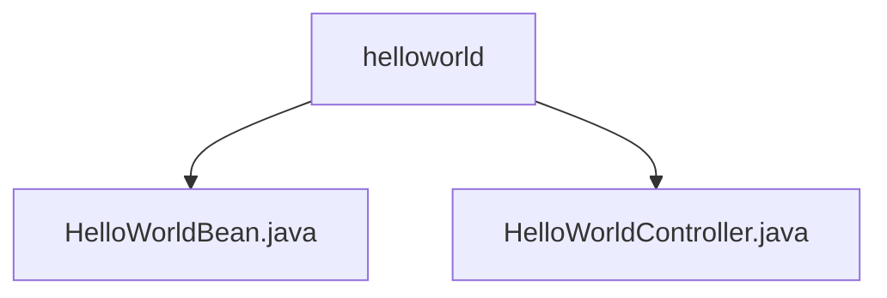

# 基础信息

|      |      |
|------|------|
| 名称 | helloworld |
| 编码语言 | .java |
| 代码路径 | spring-boot-examples/spring-boot-react-examples/spring-boot-react-hello-world-with-routing/backend-spring-boot-react-hello-world-with-routing/src/main/java/com/in28minutes/fullstack/springboot/helloworld/springboothelloworldwithrouting/helloworld |
| 包名 | spring-boot-examples.spring-boot-react-examples.spring-boot-react-hello-world-with-routing.backend-spring-boot-react-hello-world-with-routing.src.main.java.com.in28minutes.fullstack.springboot.helloworld.springboothelloworldwithrouting.helloworld |
| 概述说明 | 控制器类支持跨域请求，提供三个GET接口返回不同格式的Hello World信息。 |

# 说明

## 概述
该代码模块是一个基于Spring Boot和React的前后端分离示例项目，主要用于展示如何在Spring Boot后端应用中实现跨域请求支持，并提供多种格式的Hello World信息。该模块的核心功能是通过RESTful API返回不同格式的Hello World消息，确保前端应用（如React）能够跨域访问这些接口。

## 主要业务场景
1. **跨域请求支持**：通过配置控制器类，确保前端应用在不同域名或端口下能够正常访问后端接口，增强了系统的兼容性和灵活性。
2. **多格式数据返回**：提供了多个GET接口，分别返回纯文本、JSON等不同格式的Hello World信息，以满足不同客户端的需求。
3. **前后端分离示例**：该模块作为Spring Boot与React集成的示例，展示了如何在前端应用中使用路由功能与后端进行交互，适用于学习和开发前后端分离的应用场景。

### 包内部结构视图

该流程图展示了`helloworld`目录下的两个文件：`HelloWorldBean.java`和`HelloWorldController.java`。这两个文件都属于同一个目录，表明它们在同一层级中，且都是`helloworld`目录的直接子文件。这种结构通常用于Spring Boot项目中，其中`HelloWorldBean.java`可能是一个简单的Java Bean类，而`HelloWorldController.java`则是一个处理HTTP请求的控制器类。

# 文件列表 File List

| 名称   | 类型  | 说明 |
|-------|------|-------------|
| [HelloWorldController.java](HelloWorldController.md) | file | 控制器类支持跨域请求，提供三个GET接口返回不同格式的Hello World信息。 |
| [HelloWorldBean.java](HelloWorldBean.md) | file | 信息为空，无法生成概要描述。 |

