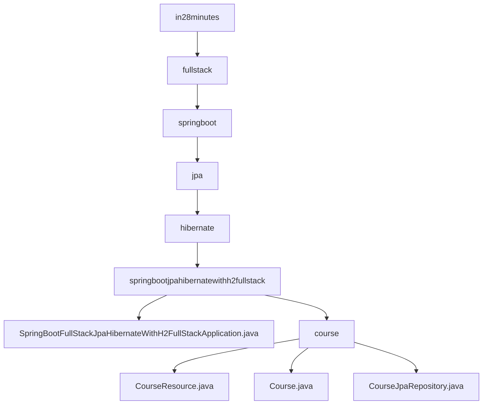

# 基础信息

|      |      |
|------|------|
| 名称 | in28minutes |
| 编码语言 | .java |
| 代码路径 | spring-boot-examples/spring-boot-react-examples/spring-boot-react-jpa-hibernate-with-h2-full-stack/backend-spring-boot-react-jpa-hibernate-with-h2-full-stack/src/main/java/com/in28minutes |
| 包名 | spring-boot-examples.spring-boot-react-examples.spring-boot-react-jpa-hibernate-with-h2-full-stack.backend-spring-boot-react-jpa-hibernate-with-h2-full-stack.src.main.java.com.in28minutes |
| 概述说明 | Spring Boot集成JPA、Hibernate和H2数据库，实现快速启动和高效数据持久化，简化数据库管理。 |

# 说明

## 概述

该代码模块是一个基于Spring Boot和React的全栈应用程序的一部分，专注于课程资源的管理。模块集成了JPA、Hibernate和H2数据库，提供了高效的数据持久化操作。通过Spring Boot的快速启动能力，应用能够简化数据库配置和管理流程，显著提升开发效率。模块的核心组件包括`CourseResource`控制器、`Course`实体类和`CourseJpaRepository`接口，分别负责处理HTTP请求、定义课程属性和进行数据库交互。

## 主要业务场景

1. **课程管理**：
   - **获取课程信息**：通过`CourseResource`控制器，用户可以查询并返回特定课程或所有课程的详细信息。
   - **创建新课程**：控制器接收课程数据并将其存储到数据库中。
   - **更新课程内容**：用户可以修改现有课程的信息，并保存更改。
   - **删除课程**：从数据库中移除不再需要的课程。

2. **数据持久化**：`CourseJpaRepository`接口负责与数据库进行交互，确保课程数据的持久化存储和检索。

3. **对象管理**：`Course`实体类通过重写`equals`和`hashCode`方法，确保在集合中正确管理和识别课程对象，从而提高代码的可靠性和一致性。

4. **跨域请求处理**：`CourseResource`控制器具备处理跨域请求的能力，支持前端应用与后端服务之间的无缝通信。

通过集成JPA、Hibernate和H2数据库，该模块能够快速启动并高效地进行数据持久化操作，适用于开发和测试环境，极大地简化了数据库配置和管理流程。

### 包内部结构视图

该流程图展示了从`in28minutes`到`course`目录的层级关系，最终指向了`SpringBootFullStackJpaHibernateWithH2FullStackApplication.java`、`CourseResource.java`、`Course.java`和`CourseJpaRepository.java`等文件。这些文件位于一个复杂的Spring Boot项目中，涉及JPA和Hibernate的集成，展示了后端项目的典型结构。

# 文件列表 File List

| 名称   | 类型  | 说明 |
|-------|------|-------------|
| [fullstack](fullstack/_module.md) | package | Spring Boot集成JPA、Hibernate和H2数据库，实现快速启动和高效数据持久化，简化数据库管理。 |

