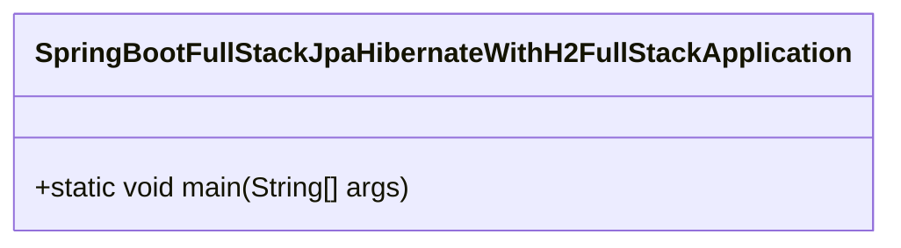
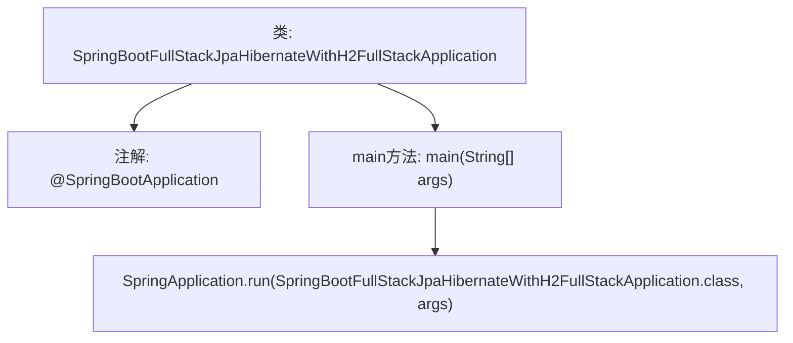

# 基础信息

|      |      |
|------|------|
| 名称 | SpringBootFullStackJpaHibernateWithH2FullStackApplication |
| 编码语言 | .java |
| 代码路径 | spring-boot-examples/spring-boot-react-examples/spring-boot-react-jpa-hibernate-with-h2-full-stack/backend-spring-boot-react-jpa-hibernate-with-h2-full-stack/src/main/java/com/in28minutes/fullstack/springboot/jpa/hibernate/springbootjpahibernatewithh2fullstack/SpringBootFullStackJpaHibernateWithH2FullStackApplication.java |
| 包名 | com.in28minutes.fullstack.springboot.jpa.hibernate.springbootjpahibernatewithh2fullstack |
| 依赖项 | ['org.springframework.boot.SpringApplication', 'org.springframework.boot.autoconfigure.SpringBootApplication'] |
| 概述说明 | Spring Boot启动类集成JPA、Hibernate和H2数据库。 |

# 说明

Spring Boot应用启动类集成了JPA、Hibernate和H2数据库。JPA提供了对象关系映射的标准接口，Hibernate作为JPA的实现，负责数据库操作。H2数据库是一个轻量级的内存数据库，适用于开发和测试环境。通过集成这些技术，应用能够快速启动并高效地进行数据持久化操作，简化了数据库配置和管理流程，提升了开发效率。

# 类列表 Class Summary

| 名称   | 类型  | 说明 |
|-------|------|-------------|
| SpringBootFullStackJpaHibernateWithH2FullStackApplication | class | Spring Boot应用启动类，集成JPA、Hibernate和H2数据库。 |

## 类 SpringBootFullStackJpaHibernateWithH2FullStackApplication

|      |      |
|------|------|
| 访问范围 | @SpringBootApplication;public |
| 类型 | class |
| 名称 | SpringBootFullStackJpaHibernateWithH2FullStackApplication |
| 说明 | Spring Boot应用启动类，集成JPA、Hibernate和H2数据库。 |

### UML类图

这段代码定义了一个名为 `SpringBootFullStackJpaHibernateWithH2FullStackApplication` 的类，该类使用了 `@SpringBootApplication` 注解，表明这是一个Spring Boot应用程序的入口类。类中包含一个 `main` 方法，该方法通过调用 `SpringApplication.run` 方法来启动Spring Boot应用程序。这个类图展示了类的结构，并突出了 `main` 方法作为程序的启动点。

### 内部方法调用关系图

这段代码是一个Spring Boot应用的入口类，使用了`@SpringBootApplication`注解来标识这是一个Spring Boot应用。`main`方法是应用的启动入口，通过`SpringApplication.run`方法启动应用，并传入当前类和命令行参数。该代码的主要作用是初始化并启动一个Spring Boot应用，为后续的JPA和Hibernate操作提供运行环境。

### 字段列表 Field List

| 名称  | 类型  | 说明 |
|-------|-------|------|

### 方法列表 Method List

| 名称  | 类型  | 说明 |
|-------|-------|------|
| main | void | 启动Spring Boot应用，使用H2数据库和JPA Hibernate框架。 |

