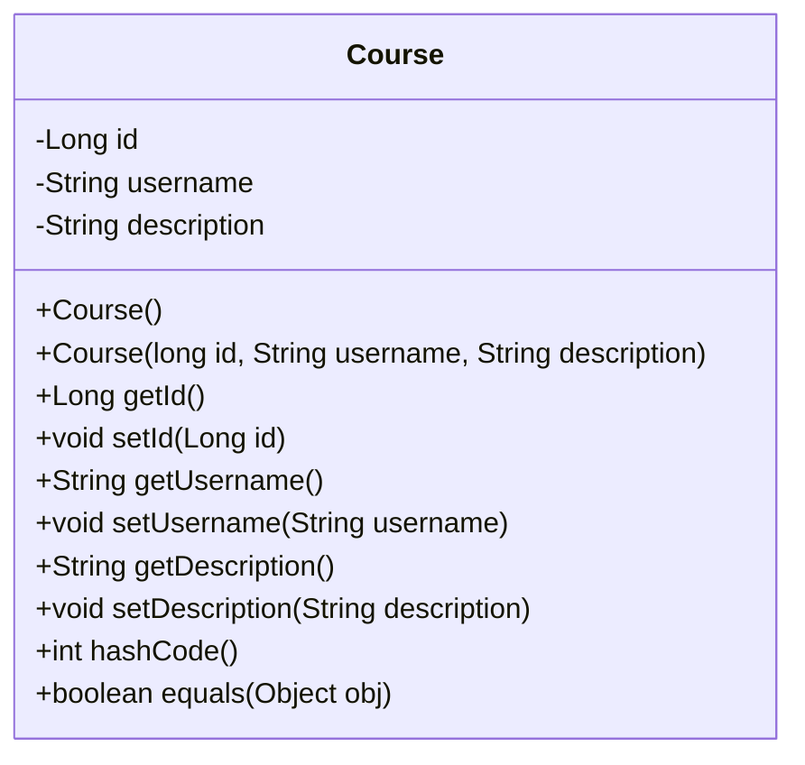

# 基础信息

|      |      |
|------|------|
| 名称 | Course |
| 编码语言 | .java |
| 代码路径 | spring-boot-examples/spring-boot-react-examples/spring-boot-react-jpa-hibernate-with-h2-full-stack/backend-spring-boot-react-jpa-hibernate-with-h2-full-stack/src/main/java/com/in28minutes/fullstack/springboot/jpa/hibernate/springbootjpahibernatewithh2fullstack/course/Course.java |
| 包名 | com.in28minutes.fullstack.springboot.jpa.hibernate.springbootjpahibernatewithh2fullstack.course |
| 依赖项 | ['jakarta.persistence.Entity', 'jakarta.persistence.GeneratedValue', 'jakarta.persistence.Id'] |
| 概述说明 | Course类含id、username、description属性，提供构造方法、getter/setter，重写equals和hashCode。 |

# 说明

Course类包含三个属性：id、username和description。该类提供了构造方法用于初始化这些属性，并包含相应的getter和setter方法以便访问和修改属性值。此外，类中还重写了equals和hashCode方法，以确保对象在比较和哈希操作时的正确性和一致性。这些方法的重写有助于在集合中正确管理和识别Course对象。

# 类列表 Class Summary

| 名称   | 类型  | 说明 |
|-------|------|-------------|
| Course | class | Course类包含id、username和description属性，提供构造方法和getter/setter，重写equals和hashCode方法。 |

## 类 Course

|      |      |
|------|------|
| 访问范围 | @Entity;public |
| 类型 | class |
| 名称 | Course |
| 说明 | Course类包含id、username和description属性，提供构造方法和getter/setter，重写equals和hashCode方法。 |

### UML类图

这段代码定义了一个名为 `Course` 的实体类，包含三个私有属性：`id`、`username` 和 `description`。类中提供了默认构造函数和带参构造函数，以及相应的 getter 和 setter 方法。此外，类还重写了 `hashCode` 和 `equals` 方法，用于对象的哈希计算和相等性比较。`Course` 类通常用于表示课程信息，并通过 JPA 注解 `@Entity` 标记为持久化实体。

### 内部方法调用关系图

```mermaid
graph TD
    A["类Course"]
    B["属性: Long id"]
    C["属性: String username"]
    D["属性: String description"]
    E["无参构造方法: Course()"]
    F["有参构造方法: Course(long id, String username, String description)"]
    G["方法: Long getId()"]
    H["方法: void setId(Long id)"]
    I["方法: String getUsername()"]
    J["方法: void setUsername(String username)"]
    K["方法: String getDescription()"]
    L["方法: void setDescription(String description)"]
    M["重写方法: int hashCode()"]
    N["重写方法: boolean equals(Object obj)"]

    A --> B
    A --> C
    A --> D
    A --> E
    A --> F
    A --> G
    A --> H
    A --> I
    A --> J
    A --> K
    A --> L
    A --> M
    A --> N
```

这段代码定义了一个名为`Course`的实体类，包含了`id`、`username`和`description`三个属性，并提供了相应的构造方法、getter和setter方法。此外，还重写了`hashCode`和`equals`方法，用于对象的哈希计算和相等性判断。通过流程图可以清晰地看到类中各个方法的调用关系和层级结构。

### 字段列表 Field List

| 名称  | 类型  | 说明 |
|-------|-------|------|
| description | String | 描述字段的私有字符串声明。 |
| username | String | 定义私有字符串类型变量username。 |
| id | Long | 实体类中使用注解标记主键ID并自动生成。 |

### 方法列表 Method List

| 名称  | 类型  | 说明 |
|-------|-------|------|
| setUsername | void | 该方法用于设置用户名的值。 |
| setDescription | void | 该方法用于设置对象的描述信息。 |
| hashCode | int | 重写hashCode方法，计算对象哈希值。 |
| getDescription | String | 该方法返回描述字符串。 |
| getUsername | String | 获取用户名字符串的方法。 |
| getId | Long | 获取对象ID的方法，返回类型为Long。 |
| setId | void | 设置对象的唯一标识符ID。 |
| equals | boolean | 重写equals方法，比较对象id、description和username是否相等。 |

